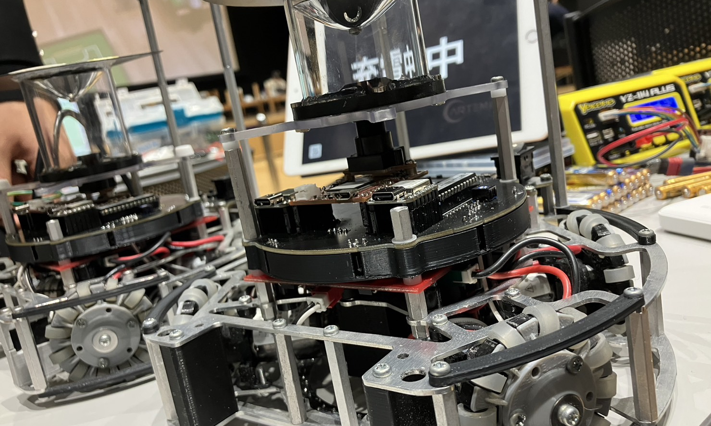
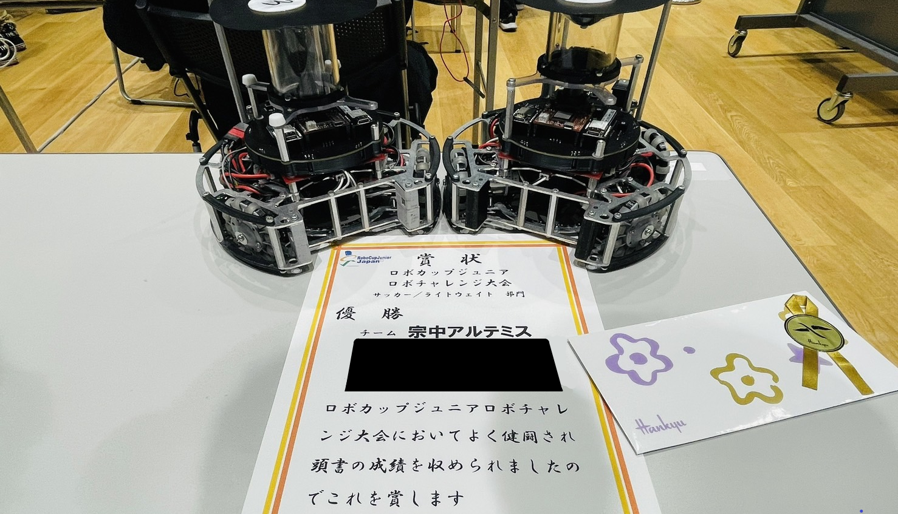

##### 公開:2022/11/28 更新:2022/11/28 writer:あくあ
---
 

# ロボチャレ2023 in 福岡 参戦！！

 
 
 

## はじめまして
---

以下、あさひにかわりましてあくあがお送りします　2022/11/27(日) 
 
皆さんこんにちは、今回は宗中アルテミスで一応キャプテンをやってます私あくあがお送りします。よろしくお願いします！ 
僕たち中学三年生はちょうど修学旅行があってブログの更新がこんなに遅れちゃいました…ごめんなさい🙇 
 
 

## 参加者の皆さん、お疲れ様でした！
---
改めて、私たち宗中アルテミスは11/27に行われたロボチャレに参加しました。本大会の運営、審判並びに関係者の皆様誠にありがとうございました。 
~~12/11に行われる~~(いつあるんだろう？？)福岡ノードでもよろしくお願いいたします。 
 
 

## 時間が足りない！！
---
**メイン**基盤が到着したのはなんと大会4日前！([抹茶くん](https://twitter.com/Mattya_Artemis/status/1596462510445854722)さぁ…(呆れ) 
でも抹茶くんがいないと我々は何もできなかったので感謝です！！ 
福岡ノード前にはプログラム班にも時間がほしいな^^ 
 
 

## 大会概要
---
今日の大会ではライトウェイト10チーム、オープン2チーム、レスキュー1チームの総13チームの参加でした。 
ライトウェイトの試合ではチームを３ブロックに分けて総当たり、という形でした。また、僕たちが参加していないオープンリーグ、レスキューリーグを見ることができ、とても新鮮で面白かったです！ 
 
 

## ロボット
---
今回僕たちのチームのロボットは前回大会のrobo.1と同じものをもう１台制作し出場しました。詳しいスペックは[こちら](https://asahi-rcj.github.io/blog/20220808/index.html)のrobo.1の部分をご覧ください。 
 
 

## 大会の反省！
---
まず**個人的な反省**として最初にあるのはあさひに対して申し訳ないという気持ちです。 
さっき触れたようにロボットが形として完成したのが遅れ、短い時間でプログラムを作らないといけなかったにもかからわず僕の技術不足によりサポートすることができず実質ワンオペのような状態になってしまいました。 
(本当にごめん) 
今回は２台とも同じものだったからよかったけど今後はそうじゃなくなるので僕自身もっと頑張らないとな、と思いました。 
試合結果としては全勝で優勝することができました。オウンゴールをなくしたりして、よりよいものにして福岡ノードに向かっていきたいです。 
 
 

## さいごに
---
今回大会では試合後のミーティングでも挙がったスケジュール管理の大切さを実感しました。 
福岡ノードに向けてより良いロボットを作れるように僕自身もっともっと頑張っていきたいです。 
そして、繰り返しになりますが12月という大変な時期に大会を開催して下さった運営、審判、関係者のみなさま本当にありがとうございました。 
 

 