##### 公開:2022/12/30 更新:2022/12/30 writer:抹茶([@Mattya_Artemis](https://twitter.com/Mattya_Artemis))
---
 

# JLCPCBで基板を発注してみよう！

 
 
 

## 始めに
---
ども！Munachu_Artemisのハードウエアを担当してる抹茶です。
 
今回初めての記事を担当させていただくことになったんですけど、日本語下手でも温かい目で見てください。 
では早速、JLCPCBで基板を発注してみようということで、ファイルの出力から、支払いまで解説していこうと思います！
 
 

## JLCPCBとは？
---
基板をすでに発注したことがある人はわかるかもしれませんが、JLCPCBは中国にある基板製造会社です。 
弊チームでは主に、ロボットに使用する基板を作るのに利用させていただいているのですが、今回JLCPCBさんにスポンサーとしてついていただけることになりました！！
学生ということもあり、このような形でサポートしていただけるのをとてもありがたく思っています。本当にありがとうございます。 
JLCPCBのホームページは[こちら](https://jlcpcb.com/JPV)です。

 
 
 

 

## 使うソフトウエア
---
今回の解説では、普段回路の設計で使用しているKiCadで解説を行っていこうと思います。 
そのうちEagleとか、Free Routingとかの使用方法とかの解説もしていきたい

 
 
 

 

## ガーバーデータの出力
---
まず最初に発注に必要なガーバーデータを出力します。 
発注したい基板のデータをKiCadで開き、左上の「ファイル」→「プロット」をクリック。
 
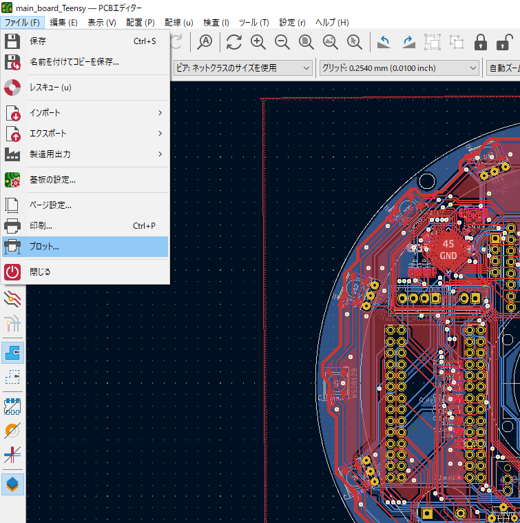 
 
 
まずは出力フォーマットが「Gerber」になってることを確認し、
レイヤーに「F.Cu」「B.Cu」「F.Silkscreen」「B.Silkscreen」「F.Mask」「B.Mask」「Edge.Cuts」が選択されていること、
オプションが次の写真のように選択されていることを確認して下さい。
 
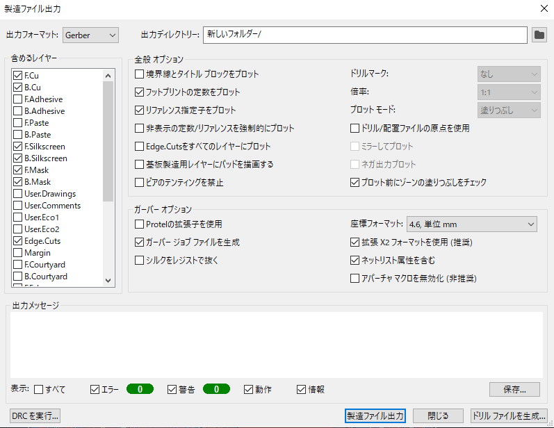 
 
 
次に、出力ディクトリを選択します。 
自分はいつも出力するファイルだけをまとめるために、新しくファイルを一旦作ってそこに出力しています。
(JLCPCBのサイトでデータを読み込むときに少しめんどくさくなるので...) 
場所自体は、基板データと同じところに入れてます。
 
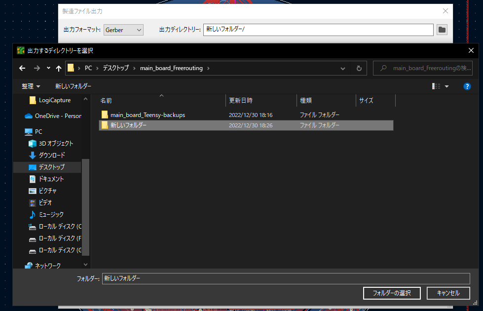 
 
 
次にデータの出力を行っていきます。 
右下の「製造ファイル出力」をクリックし、メッセージに「完了」と出るのを確認して下さい。
 
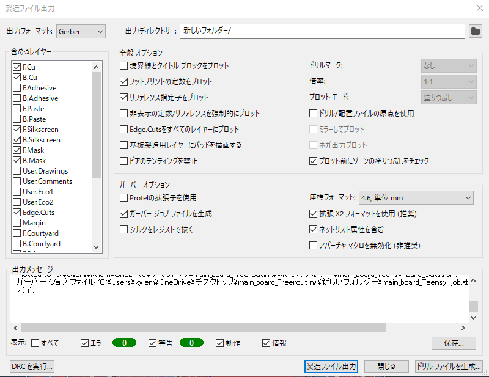 
 
 
確認ができたら、「ドリルファイルの生成」をクリック。
下の写真のようにオプションが選択されているのを確認して下さい。
出力フォルダは先ほど製造ファイルを出力したところと同じにして大丈夫です。
 
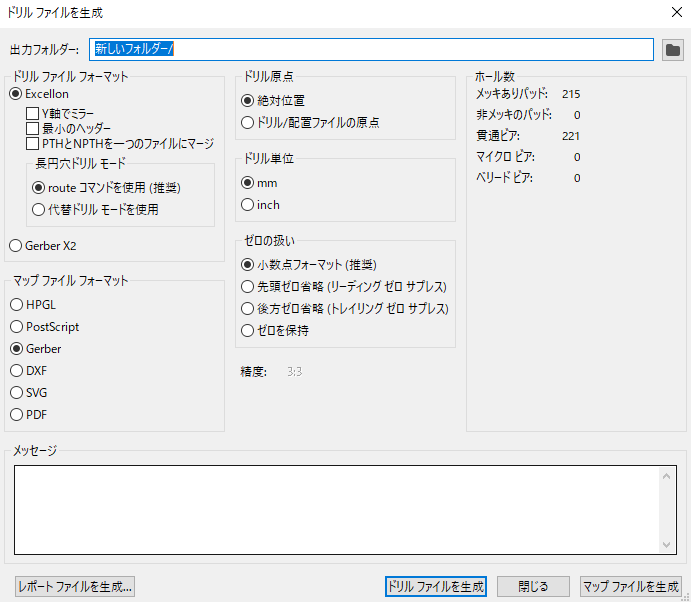 
 
 
最後に、「ドリルファイルを生成」をクリックし、先ほどと同じようにメッセージに「完了」と表示されるのを確認して下さい。
 
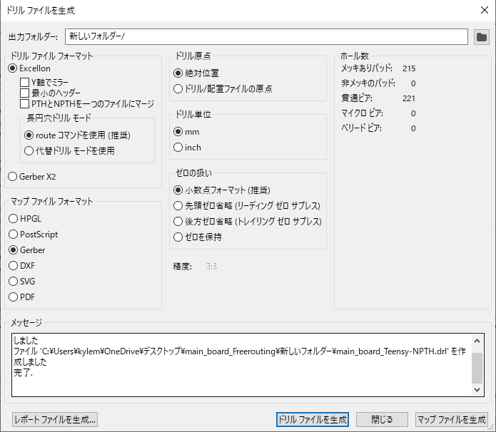 
 
 

## ガーバーデータを圧縮しよう
---
先ほど出力した、ガーバーファイルの入ったファイルをZIPファイルに圧縮します。 
※ファイル名が英語でないとJLCPCBのサイトで読み込んでくれない可能性があります。(少なくとも自分はそうでした...)
 
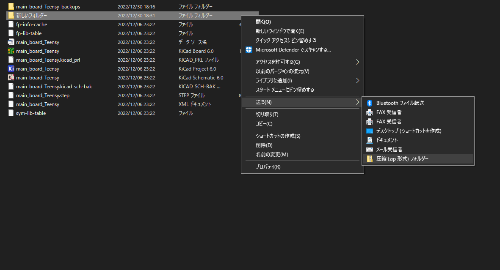 
 
 

## 発注しよう！！
---
最初にガーバーデータのアップロードをします。 
JLCPCBのホームページを開いてログインした後,右上の「Order now」をクリックして下さい。
 
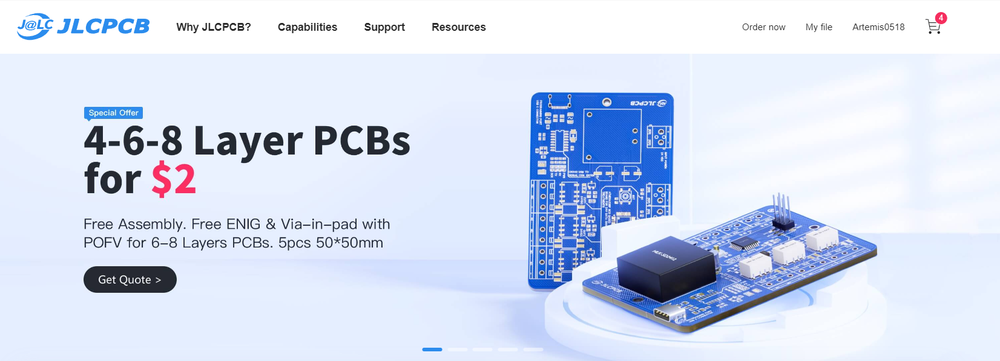 
 
 
写真のような画面に移動するはずなので、PCBのタブの「Add gerber file」をクリックし、
先ほど圧縮したZIPファイルを選択して下さい。
 
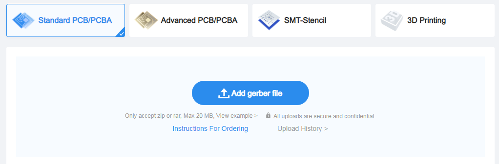 
 
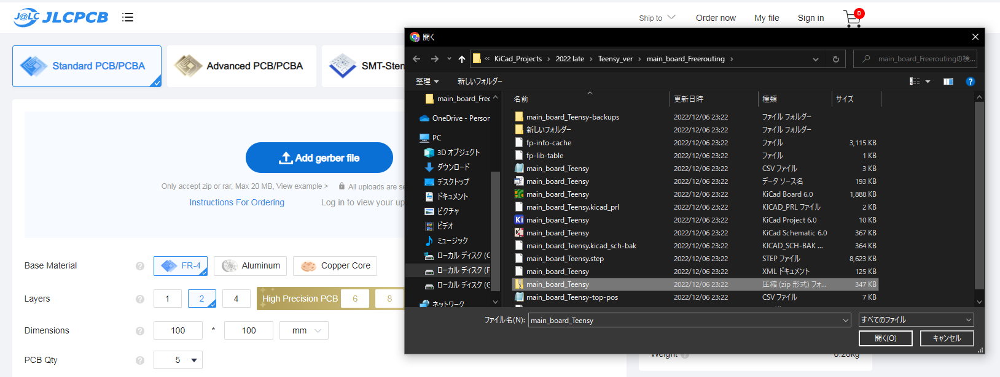 
 
 
アップロードが完了すると画像が表示されるので必ず自分が発注したいファイルかを確認してください。 
※よく違うファイルを選択してしまうので...
 
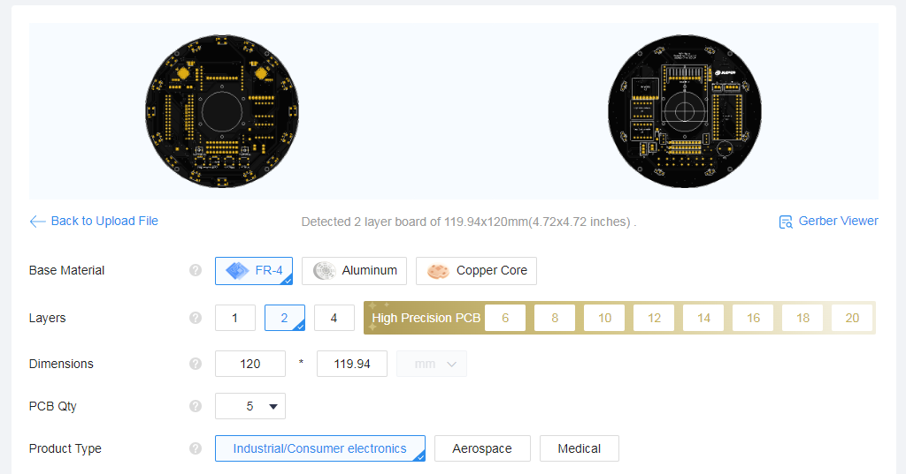 
 
次に、発注のオプションを選択します。基本,以下の4つくらいしかいじる必要がないかと思います。 
・Base Material：基板の素材　　　　 
・Layers       ：基板のレイヤー数　 
・PCB Thickness：基板厚(mm)　　　　 
・PCB Color    ：基板の色　　　　　
 
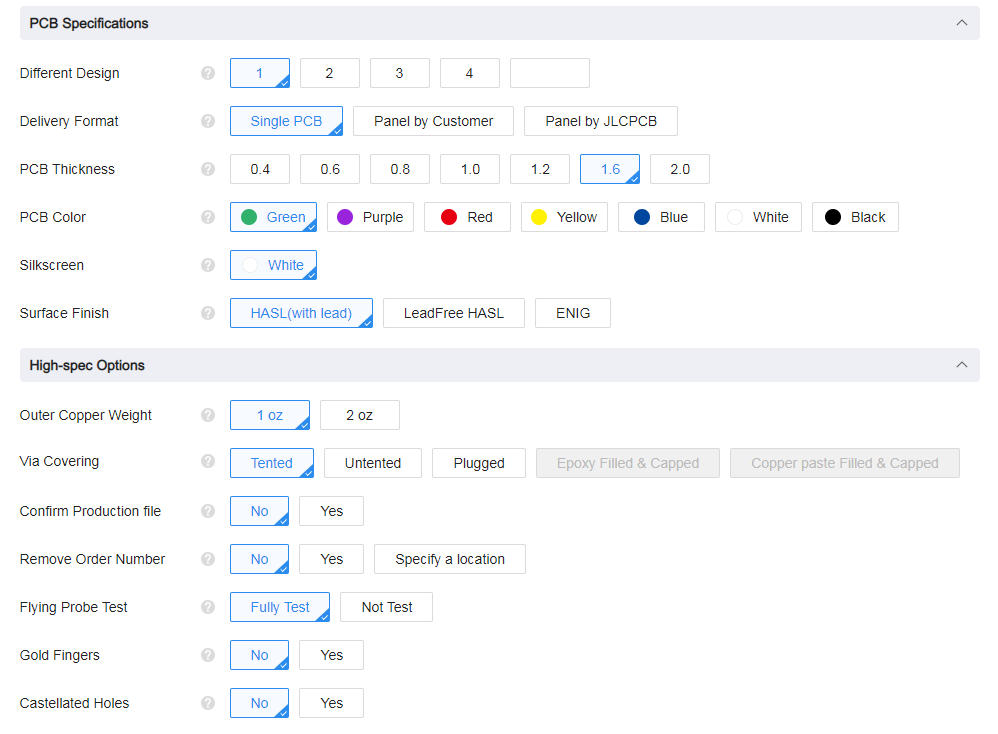 
 
 
※基板の色は緑以外の色を選択すると、緑の基板に比べ、製造に時間がかかるため、急ぎの基板や試作の基板は
緑色で発注することをお勧めします。
 
 
オプションの選択が終わったら「SAVE TO CART」を押してカートに保存します。
 
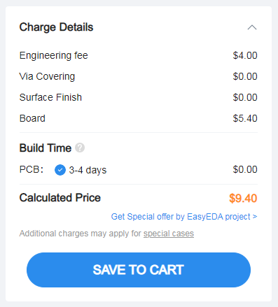 
 
 

## 決済する
---
カートの画像横のチェックマークで発注したい基板を選択し、値段などを確認後、「Secure Checkout」をクリックします。
 
 
 
その後、住所情報や発送方法を選択して発注が完了します。
 
 

## 最後に
---
今回は初めてのブログでJLCPCBでの基板発注方法について解説しましたが、ブログを書く大変さを身に染みて実感しました。
高頻度でブログ更新してる人はほんとに尊敬します。 
JLCPCBは発注がとても簡単なうえ、安くかつ早く届くのでとてもおすすめです。 
~どちらかというとKiCadがむずk...~ 
近いうちに表面実装部品付きで基板を発注する方法も解説する予定なのでぜひそちらの方も書いたら読んでみてください！！ 