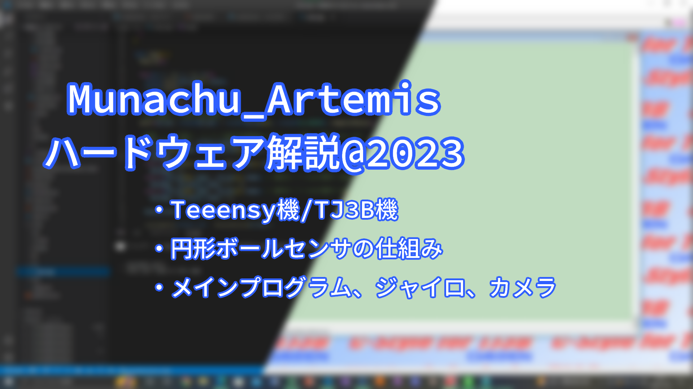
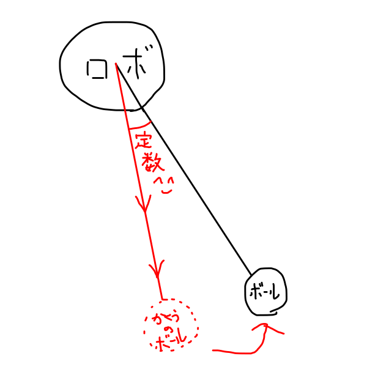
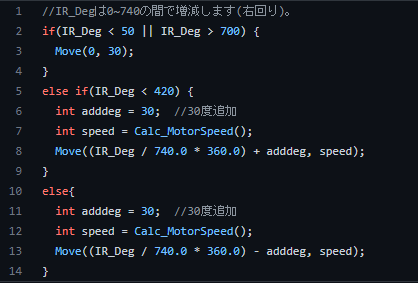
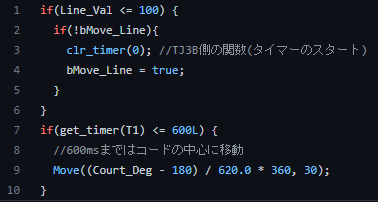

##### 公開:2023/00/00 更新:2023/00/00 writer:あさひ([@asahi_robocuper](https://twitter.com/asahi_robocuper))
---
 

# Munachu_Artemis ソフトウェア概要:2023

 
 
 

## ソフトウェアやで～
---
どうも、あさひです。 
改めまして、全国大会に出場した皆さん、お疲れさまでした。また、大会に携わってくれたスタッフや運営の皆様、ありがとうございました。 
さて、僕たちのRCJ 2023 Seasonは終わり、2024 Seasonに向けて準備をしているわけですが、まずは2023 Seasonのロボットのハードウェア解説をしておこうと思います。 
初心者なりに頑張って作ったプログラムを見てほしい！！！！(切実) 
 
 

## ロボットはどんなもん？
---
まあ、ソフトウェア部分の解説のためにはハードウェアの理解が必要ですからね！[前回の記事](https://asahi-rcj.github.io/blog/index.html)を見てくれたら分かると思います！(宣伝) 
 
 

## ~ 九州ブロック
---
過去の記事を見てもらったら分かる通り、僕たちのロボットは九州ブロック以前と全国大会で全く異なっています。 
なので、まずは九州ブロックまでのソフトウェア構成についてまとめて行こうと思います。

### 使用環境
|  プログラム  |  使用環境  |
| ----------- | --------- |
|  メインプログラム  |  C-Style for TJ3B  |
|  ジャイロ・ボールセンサプログラム  |  Platform IO  |
|  カメラプログラム  |  OpenMV IDE  |

 

### メインプログラム
この時は結構簡単なことしかしていなかったです。センサー読み取って、ごちゃごちゃ計算して、モーターを動かしています。 
モーターを動かすとき、わざわざ一つずつ値を指定するのが大変だったので、角度と速度を指定して動かす関数を作ってます。 
 
 
 
ボールの回り込みについては、読み取ったボールの角度からn度分足した場所に移動するようにすることでうまい具合に行くようになってます。 
(図が雑ですがあまり気にしないことにしておいてください) 
 
 
 
 
 
 
(Culc_MotorSpeed() はボールの距離に応じて速度の値を返す関数です) 
 
ラインアウトの防止のために、カメラでコートの色取りをして、緑成分の多いほうに動く、というプログラムを組んでますが、不安定なので早くラインセンサでの制御をしたいところ。 
 
 
 
 
 

### Ball Sensor Ring プログラム
この時のロボットは赤外線センサを8個搭載していたので、まずはすべてのセンサの値を読み取り、一番反応しているセンサの割り振り番号を角度に変換したものをanalogで出力していた形になります。 
まあ、このプログラムに関してはあまり言うこともないと思います、ある程度ポピュラー(?)な処理の仕方かな。
 
 

### ジャイロプログラム
この記事を見たらわかります！！(宣伝2) 
[MPU6050をSeeeeduino Xiaoで動かしてみた](https://asahi-rcj.github.io/blog/20220809/index.html) 
MPU6050のDMP機能を使って求めた角度をanalogで出力していました。

### カメラプログラム
カメラはOpenMV H7を使っていたので必然的にOpenMV IDEを使って開発をしていました。
言語はMicroPythonかな？ 
簡単にいうと、画面からゴール