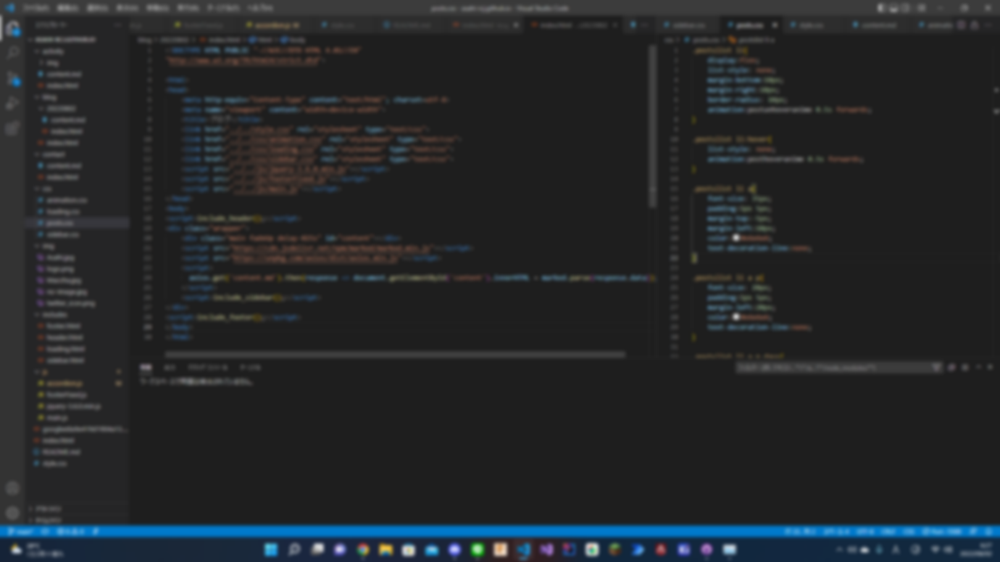

##### 公開:2022/08/02 更新:2022/08/03 writer:あさひ([@asahi_robocuper](https://twitter.com/asahi_robocuper))
---
 

# 初めてウェブサイトを作ってみたという話

 
 
 

## 初めに
---
あなたがこの文章を読んでいるということは、私はもうこの世にはいません…。  
  
冗談はさておき、初めてのウェブサイトを作ってみました。  
至らない点が多々あるかもしれませんが、暖かい目で見守ってください。  
 
 

## 経緯
---
まず、私がウェブサイトを作ってみようと思った経緯から話そうと思います。 
そのためには、私が行っている活動から話さなければなりません。 
私は RoboCupJunior LightWeight (以降 RCJ)という、サッカーロボットを作成する活動を行っています。
そして、その活動の一環として、RCJで培った技術や知識を公開しようということでウェブサイトを作りました。 
本当は趣味のつもりで作る予定でしたが、意外と本格的な形になっちゃいました。  
 
 

## 制作中に感じたこと
---
**めちゃくちゃしんどかった**。  
初めてのウェブサイト作成、と言いましたが、実をいうとHTMLもCSSもJavaScriptも何も知らない状態でした。
そのため、まず基礎の基礎から勉強しつつ、**Copy and Paste** でここまで乗り切りました。 
でも、途中からCSSの中身を少しずつ理解してきて、デザインを作るのが楽しすぎたせいで必要のないところまでアニメがついてたりします。 
そこは凝り性、良くも悪くもという感じです。ただ、いい感じにまとまったのでヨシ！(現場猫)   
  
(作り始めたのが8/1の13時、大体出来上がったのが8/2の5時…。意外と早くできてびっくりした。)
 
 

## 制作を終えて
---
一つ言わせてもらうと、**プログラミングをしたことがない人には絶対にお勧めしません。**  
一応C言語だったり、Javaだったりの知識はあるんですが、それでも1時間くらい沼にはまりました。
本当にお勧めしません、苦行です、WixとかWordPressとか使ったほうが100倍楽だし機能性も高いです、これガチ。
ただ、作り上げた時の爽快感というか、満足感は他では味わえないと思うので、チャレンジしてもいいかもしれません。
完成してよかった、そう思った一日でした…。 

先ほど言った通り、このウェブサイトはRCJでの技術公開とか、個人的な知識公開などに使う予定です。
皆さんが読んでなるほど、と思えるような記事作成に努めますので、何卒よろしくお願いします。
そんなわけで、初記事はここで締めさせていただきます。ありがとうございました。 
 
 
 
(課題、やらないとな…。)