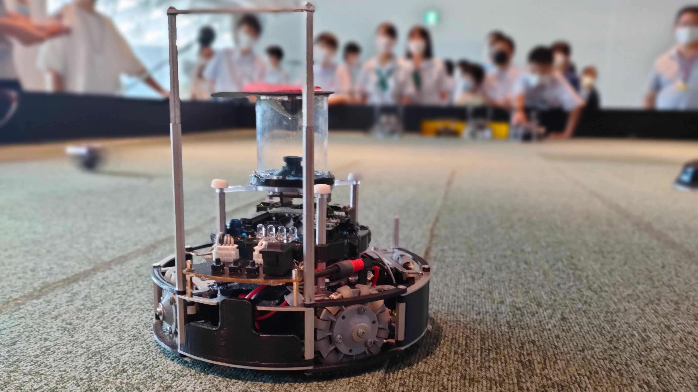
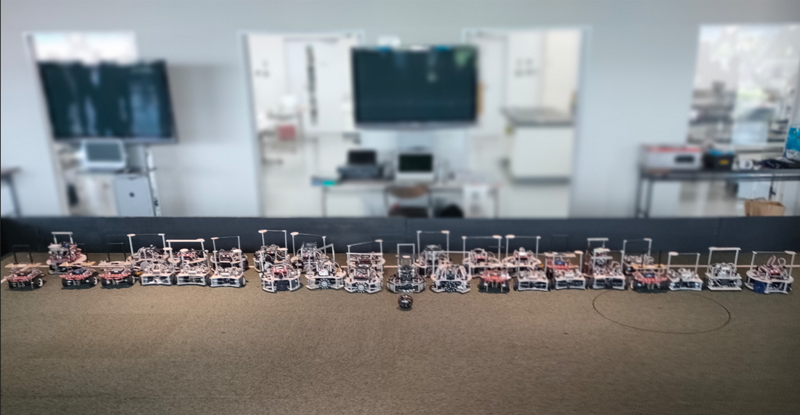

##### 公開:2022/08/08 更新:2022/08/08 writer:宗中アルテミス([@munachu_artemis](https://twitter.com/munachu_artemis))
---
 

# 2022 北九州オープン振り返り

 
 
 

## 北九州オープン、お疲れさまでした
---
私たち宗中アルテミスは、2022年8月6日・7日に開催された、北九州オープンという大会に参加しました。
大会の運営、並びに関係者の方々、この度は大会の開催・運営をしていただきありがとうございました。  
そして、参加者の皆さんもお疲れさまでした。 
 
 

## 大会内容
---
ライトウェイトでは総勢15チームが参加しました。
一日目では、総チームを3ブロックに分けたうえでの総当たり戦が実施されました。
各チーム4試合ずつ行い、ブロックごとの優勝者が賞状を授与されます。
二日目は、総チームが、SuperTeamに分かれ対戦が行われました。 
 
 

## ロボットについて
---

| スペック | 名前 |
| :--- | :--- |
| メインマイコン &nbsp;&nbsp;&nbsp;&nbsp;| TJ3B Loader 2620 |
| モータードライバ | DAISEN DSR-1202 |
| モーター | JMP-BE-3561 x 4 |
| ジャイロセンサ | MPU6050 |
| ジャイロセンサ処理 | Seeeduino Xiao |
| ボールセンサ | TSSP58038 x 8 |
| ボールセンサ処理 | Seeeduino Xiao |
| ラインセンサ | S4282-51 x 16 |
| カメラ | OpenMV M7 |

 
 

## 大会を終えて
---
### 一日目
今回の大会で一番反省点だったのはプログラムのダウンロードミスでした。
エラーが出ていたり、間違えていたりしたプログラムをロボットにダウンロードすることでロボットが正常に動作しないということが何度か発生しました。
焦りすぎた…。 
カメラを使ったラインの制御がとても綺麗になっていて、ライン上でﾋﾞﾀｧｯ!っと止まっていたので感動しました。(小並感)

### 二日目
**めちゃくちゃ楽しかった**。途中でボールセンサの隠しを取ったのでコートの半分以上の距離にあるボールが見えるようになりました。 
(~~一日目で気付いてればよかった~~) 
参加者や観覧者含め、全員で楽しく試合を行うことができ、また他チームとの交流があってとても楽しい日となりました。 
 
 

## これから
---
### ジャイロセンサのプログラム改良
今回の大会(というかロボットを作っていて)気付いたこととして、ジャイロセンサ(MPU6050)の値のずれが大きいなと感じました。
Arduino IDEの方にスケッチサンプルがあるようなので、そちらを活用してみようと思います。
 

### コートの色取りの仕方を工夫する
今回の大会のコートでは、明るい部分と暗い部分の差が大きかったため、偏った色取りをしてしまい、明るいほうでライン制御ができなかったという問題がありました。 
コートの色取りをする場所または色取りの方法を工夫していこうと思います。 

 
 

## 最後に
---
今回の大会を通して、自分たちのロボットの反省点を見つけることができました。
次はロボチャレ(多分11月末)の大会に向けて、より良いロボットを作れるよう頑張りたいと思います。
最後になりますが、改めて、北九州オープンの運営をしてくださった関係者の皆様、本当にありがとうございました。 
 

 
ここまで読んでいただきありがとうございました。