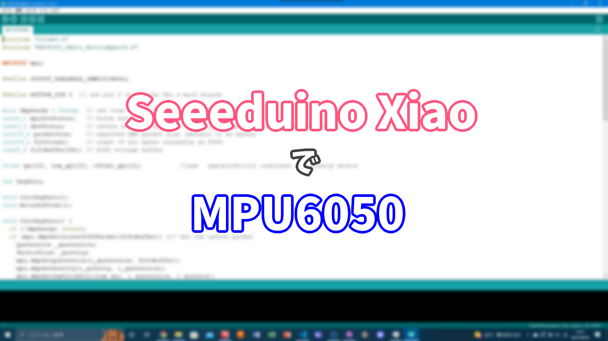
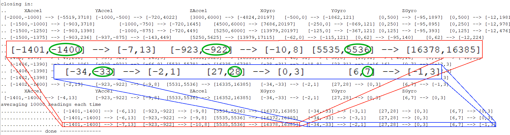
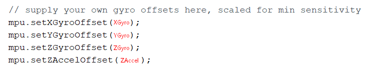
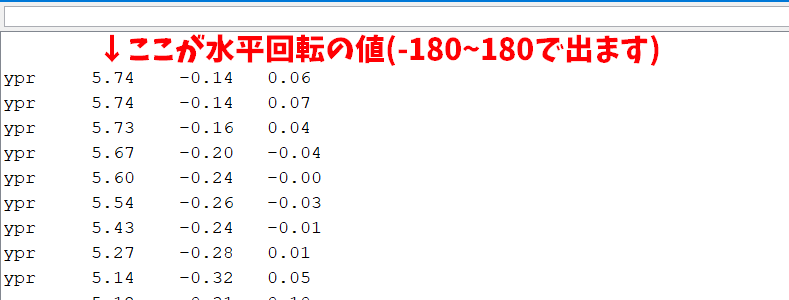

##### 公開:2022/08/09 更新:2022/08/09 writer:あさひ([@asahi_robocuper](https://twitter.com/asahi_robocuper))
---
 

# MPU6050をSeeeduino Xiaoで動かしてみた

 
 
 

## 前置き
---
(先日公開した「[2022 北九州オープン振り返り](https://asahi-rcj.github.io/blog/20220808/index.html)」という記事はご覧になられたでしょうか。
見てない方は先にそちらを見ることをおすすめします。) 
 
皆さんこんにちは、あさひです。先日の北九州オープンでは、ジャイロセンサーの値のずれが大きく、正しく動かない場面が多々見られました。
もともとI²Cで生の値を読み取って計算をしていたんですが、それだと正確に角度が出なかったため、いろいろ試行錯誤した結果、後日解決した(?)ので備忘録として記事を作成しました。 
 
 

## 何をするのか
---
今回MPU6050を使用するにあたって、Arduino IDEのライブラリ「MPU6050」を利用し、角度の計算を行っています。
しかし、Arduino IDE側からライブラリを導入すると、Seeeduino Xiaoでライブラリを使用した際にエラーが発生したため、
ライブラリの制作者のGithubから手動でライブラリを導入しています。 
 
 

## 作業環境
---
Seeeduino XiaoでMPU6050を動作させています(I²Cで接続)。
また、統合開発環境として、Arduino IDEを利用しています(理由は先述した通り)。 
 
 

## ライブラリを導入しよう
---
Arduino IDEでのライブラリの手動導入方法に関してはほかの人がやっていると思うのでここでは割愛いたします。
[ElectronicCats氏制作のライブラリ(MPU6050)](https://github.com/ElectronicCats/mpu6050)を導入します。 
 
 

## センサーの校正
---
Arduino IDEを開き、「ファイル」→「スケッチ例」→「MPU6050」より、「IMU_Zero」を選択し、Seeeduino Xiaoにプログラムを書き込みます。
その後、センサーの校正が始まるので水平な部分で2~3分程放置をします。「Done」という文字列が表示されたら終了です。
校正した値は、Doneと表示された行の一行上の部分の値に表示されています(下の画像を参考)。 
 
 
緑枠の数字部分、左上から順番に[XAccel, YAccel, ZAccel, XGyro, YGyro, ZGyro] 
 
 

## 実際に値を出してみよう
---
「ファイル」→「スケッチ例」→「MPU6050」より、「MPU6050_DMP6」を選択し、下の画像の通りにプログラムを書き換えます。
具体的には、200行目付近にある関数の引数値を先ほど算出したセンサーの校正値に書き換えます。(赤文字部分) 
 
 
 
その後、プログラムをSeeeduino Xiaoに書き込み、センサーモニターを開くと値が出力されています。 
 
 
 
 

## まとめ
---
Arduino IDEのみでライブラリを導入できる機能を使用してSeeeduino XiaoでMPU6050を動作させようとするとライブラリ側のエラーが発生するので、
制作者のGithubからダウンロードしないといけないっていうのに気付くのに時間がかかりました。
皆さんもMPU6050をSeeeduino Xiao(というか、ATSAMD系統かな？)を使うときは気を付けましょう…。 
一応、僕たちのロボットではMPU6050を使って綺麗な角度制御をすることができました。 
これからMPU6050を使って綺麗な角度制御ができるようプログラムを頑張っていきたいと思います。 
 
(技術記事を書くのは初めてなので間違いなどありましたらTwitterやコメント欄などで教えてくれるとありがたいです...。)
 
