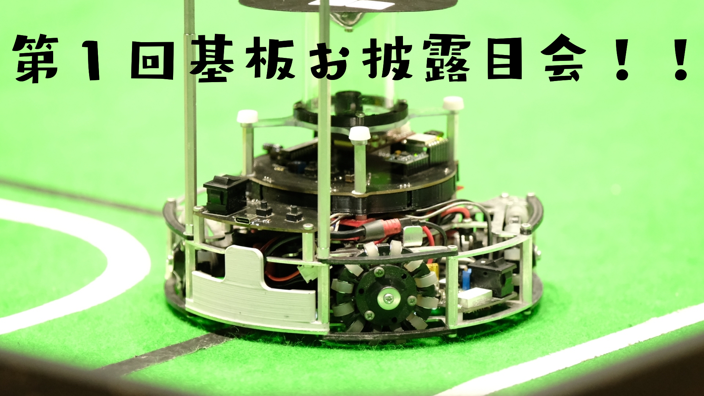
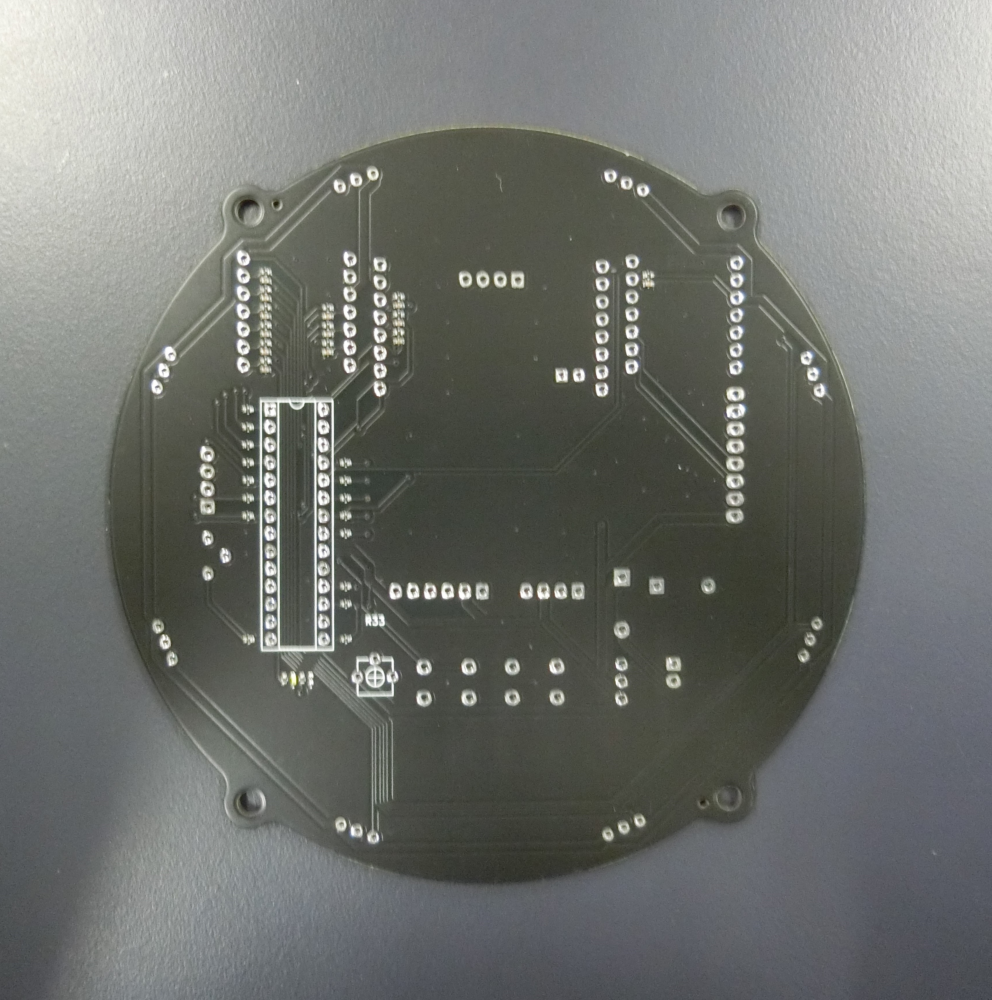
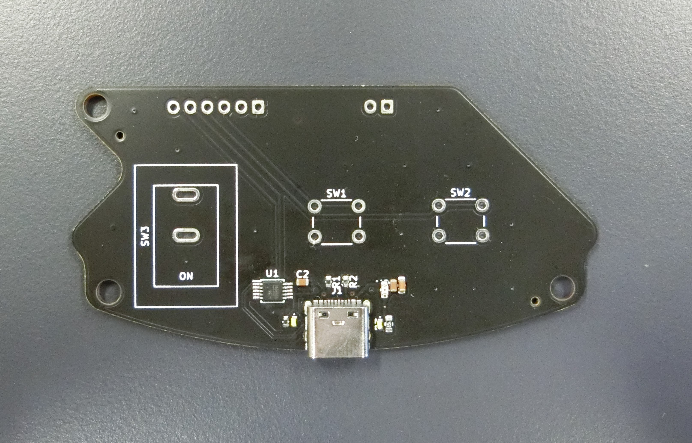
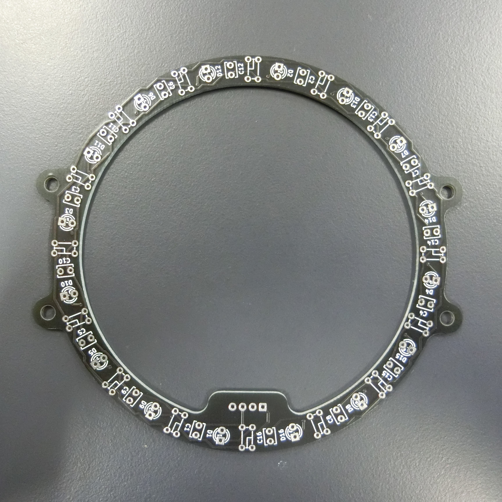
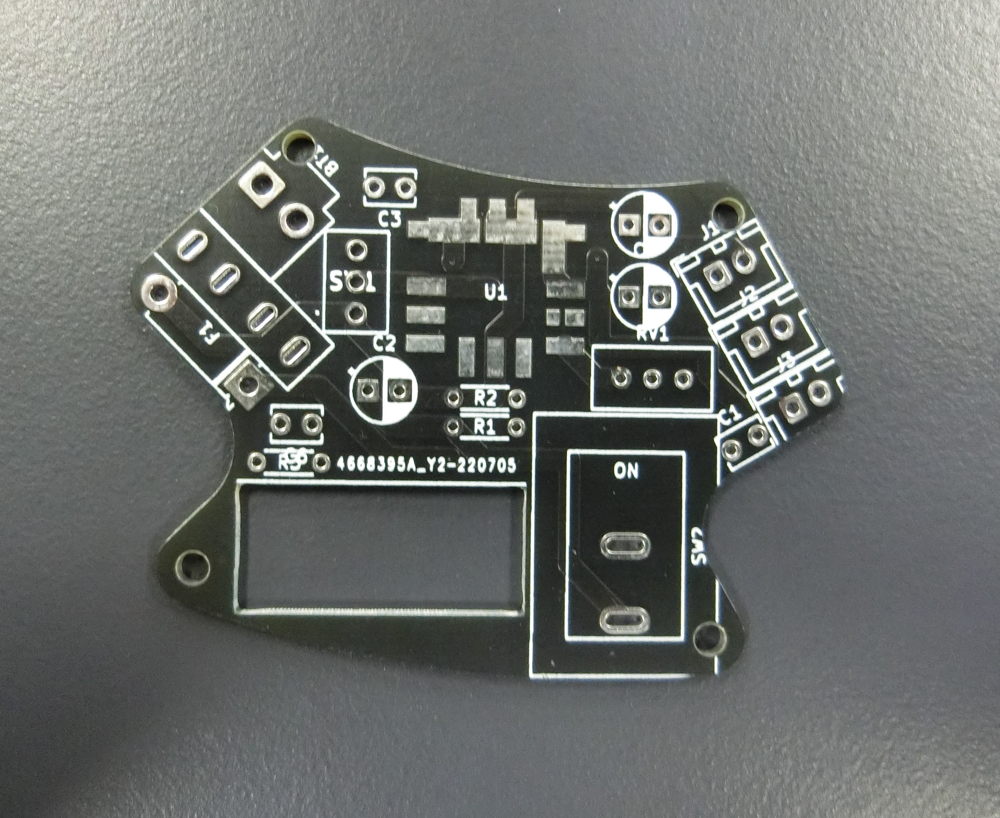

##### 公開:2023/02/26 更新:2023/02/26 writer:抹茶([@Mattya_Artemis](https://twitter.com/Mattya_Artemis))
---
 

# 第一回基盤お披露目会！！

 
 
 

## 始めに
---
ども！Munachu_Artemisのハードウエアを担当してる抹茶です。 
前回に続き、JLCPCBで発注させていただいた基盤を紹介していきたいと思います。とりあえずこの記事では福岡ノード、九州ブロックで使用した機体の基盤を紹介しています。 
（キッカー実装機の詳細と基盤の紹介ついては次の記事で紹介する予定です～）
 
 
今回紹介させていただく基盤はすべてJLCPCB様にスポンサーとしてついていただき、無償で提供していただいています。 
JLCPCB様、大変ありがとうございます。 
JLCPCBでの基盤の発注の仕方は[こちら](https://asahi-rcj.github.io/blog/20220808/index.html)で解説しているのでぜひ覗いてみてください！！
 
 

## メイン基板
---
まずはメイン基板を紹介していきます。 
中心の基盤にはボールセンサやカメラだけを載せているチームもいますが、弊チームではほぼすべての機能をメイン基板にまとめています。 
メンテ性には欠けますが、自分は一番のロボットの故障原因は配線の断線だと思っているので、基盤と基盤をつなげる配線をできるだけ少なくなるように、この方法を採っています。
 
 
 
 
 
この基盤の反省点としてはあまりにもシルクがなさ過ぎたことですね... 
どこにどの配線をつなげればいいかがKiCadをわざわざ開かないとわからなくて、配線作業だけで一日かかってしまったんですよね（汗汗...

## IO基盤
---
次にIO基盤を紹介していきます。 
この基盤はTJ3Bのスタート・ストップやモータドライバの電源スイッチ、プログラムの書き込み口を持って来ています。 
IOは本来Input/Outputという意味ですが、なんとなくかっこいいのでこの名前で読んでいますｗ（Output要素０なんだけどな...
 
 
 
 
 
お気づきの方もいるかもしれませんが、シリアル変換ICを実装してTJ3BにType-Cでプログラムの書き込みができるようになっています。 
かっこいいだろ～～＾＾
 
 

## ラインセンサ
---
次にラインセンサを紹介していきます。 
センサとLEDを１６個づつ円形に配置しています。これで反応している時間が長くなり、スピードを出してもある程度対応できるようになりました。
 
 
 
 
 
実はこう見えてすべてのセンサを並列で接続しているため、センサ１個乗っているのと変わりないんですよね... 
マイコンがTJ3Bである以上、ポートが足りないのでしょうがないんですよね... 
（早くメインマイコンTeensyに変えたいな～
 
 

## 電源基盤
---
最後に電源基盤を紹介して終わりたいと思います。 
DC-DCコンバータを使用して制御、駆動それぞれの電源を１つのバッテリーからとれるようにしました。 
「みんなそうしてない？？」と思う方のいるかと思うんですが、実はうちの部活、去年までノイズ対策の技術がなく、
制御と駆動で電源を分けていたんですよね... 
今でも後輩たちは分けてますが、自分の学年以上はほぼみんなDC-DCコンバータを使用するようになりました。
 
 
 
 
 
この基盤はやっぱり部品が必要以上に多かったことが反省点ですね。 
明らかに電解コンデンサとか全部いらなかったですし...次の電源基盤は部品点数を減らして配線を太くしようと思います。
 
 

## 最後に
---
基盤の紹介をしましたが文章量多くなってハードウエア解説みたいになってしまったな... 
最後まで読んでいただいた方、ありがとうございます！！ 
次、自分が書く記事は制作中のキッカー実装機について書こうと思っているのでぜひそちらのほうも楽しみにしていて下さい！！ 
ではここらへんで～ 

