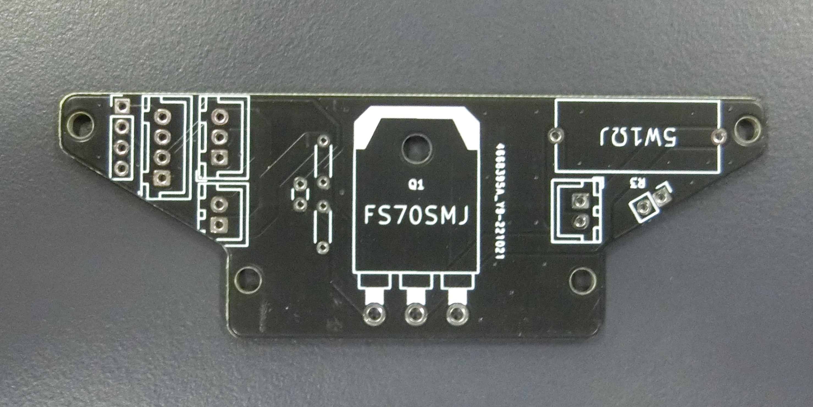
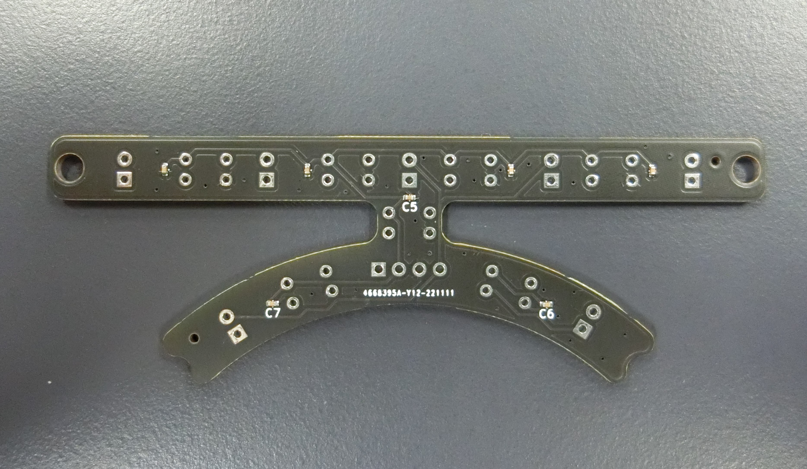
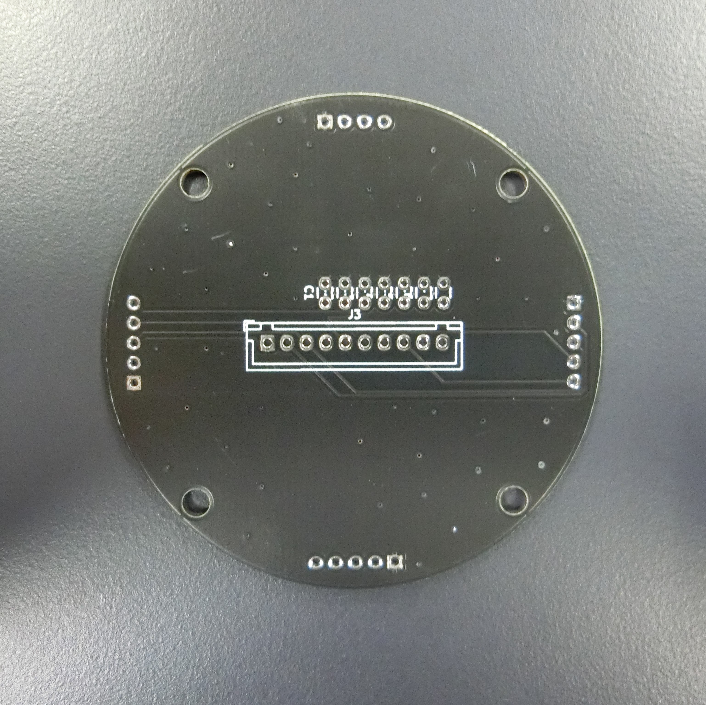

##### 公開:2023/02/27 更新:2023/02/27 writer:抹茶([@Mattya_Artemis](https://twitter.com/Mattya_Artemis))
---
 

# 第二回基板お披露目会！！

 
 
 

## 始めに
---
ども！Munachu_Artemisのハードウエアを担当してる抹茶です。 
前回、第一回基盤お披露目会で福岡ノード、九州ブロックで出したロボットに載ってる基板を紹介しましたが、
今回は第二回ということでキッカー試作機の基板を紹介していきます。 
続けての基板紹介ですが、基板紹介のブログがたまってたんですよね... 
JLCPCB様いろいろと遅くなり申し訳ございません。  
今回紹介させていただく基盤はすべてJLCPCB様にスポンサーとしてついていただき、無償で提供していただいています。
JLCPCBでの基盤の発注の仕方は[こちら](https://asahi-rcj.github.io/blog/20221230/index.html)で解説しているのでぜひ覗いてみてください！！
 
 

## メイン基板
---
最初にメイン基板です。TJ3B機と同じようにほとんどの機能をこの基盤にまとめてます。 
この基盤から省スペース化、軽量化のためにマイコンの自作を始めました。 
この基盤にはArduino Leonaldoを２個積んでます。 
 
 
 
ルールを無視して乗っけたNeoPixelはみなかったことにしてくださいｗ
 
 

## IO基板
---
次にIO基板ですね。前回の基板紹介でも説明してますが「IO」は「Input」「Output」の略です。 
この基盤にはLCDモニタ、ボタン類、全マイコンの書き込み口を持ってきてます。 
 
 
 
メイン基板との接続はピンヘッダとピンソケットを使用してて配線を１つも使用していません💪
 
 

## キッカー電源
---
次にキッカー電源について紹介します。キッカー電源？ってなると思うんですけど、
場所が無くて昇圧周りとソレノイドの制御を２つの基盤に分けてます。
それの昇圧回路周辺の基板ですね。 
 
 
 
XL6009、2200μFのコンデンサ2つ、遮断用FETくらいしか乗ってません。
 
 

## キッカー制御
---
次にキッカー回路の制御のほうの基盤です。 
制御用のFET、タッチセンサの端子があるくらいです。 
タッチセンサと場所が近いのでここにタッチセンサを接続することにしました。 
 
 
 
FETが必要以上に大きいですが、これも見なかったことにしてください。ロマンが全てです。
 
 

## ラインセンサ（前）
---
何の変哲もないライセンサです。4つに分けてるセンサのうち、前側に使用するものです。 
 
 
 
私にセンサ1つずつ読めるようにする力はないので全てのセンサを並列につなげてます。
 
 

## ラインセンサ（右、後、左）
---
こちらも何の変哲もないラインセンサです。 
設計の手間を省くため前以外は同じ基盤が使えるようになってます。 
 
 
 
こちらのセンサは外側と内側で別で読めるようにしてます。
 
 

## ライン統合基盤
---
これはすべてのラインセンサを1つの基盤に集めるものです。
ここからメイン基板に信号線を伸ばしてます。 
 
 
 
（基板数多いな...汗汗
 
 

## 電源基盤
---
最後に電源基盤です。TJ3Bロボットと特に変わった点はないですね。 
基板の大きさが大きくなったのでより配線を太くしたりしました。 
 
 
 
自分の場合、電源基盤が一番設計時にエラーが出ずに設計終わるのに、一番動いてくれない基板なので嫌いなんですよね...
 
 

## 最後に
---
ここまで見ていただいてありがとうございます。
前回に比べて基板の数がだいぶ増えました。キッカーを載せるに当たってだいぶ機能と費やす時間・労力が増える事が実感できました。 
そういえば一回もキッカー試作機についての説明をしたことがなかったので次回はキッカー試作機かTJ3B機のハードウエア解説でもしようかと思ってます。 
ではここらで～ 