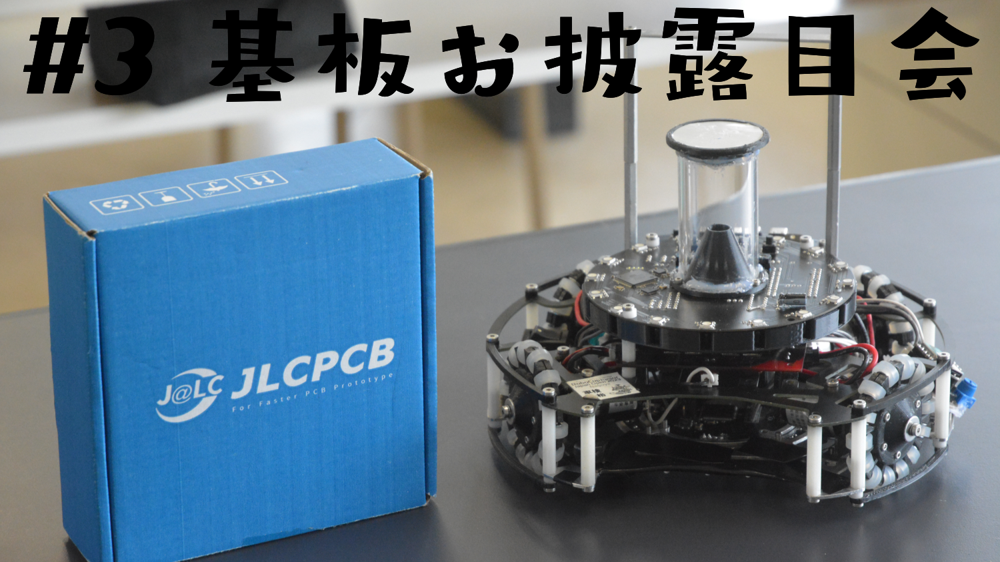
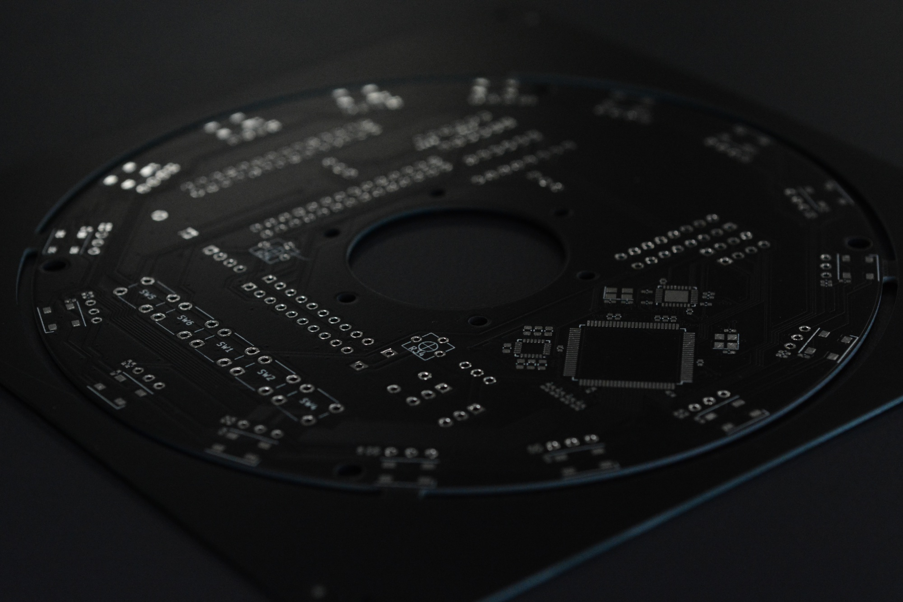
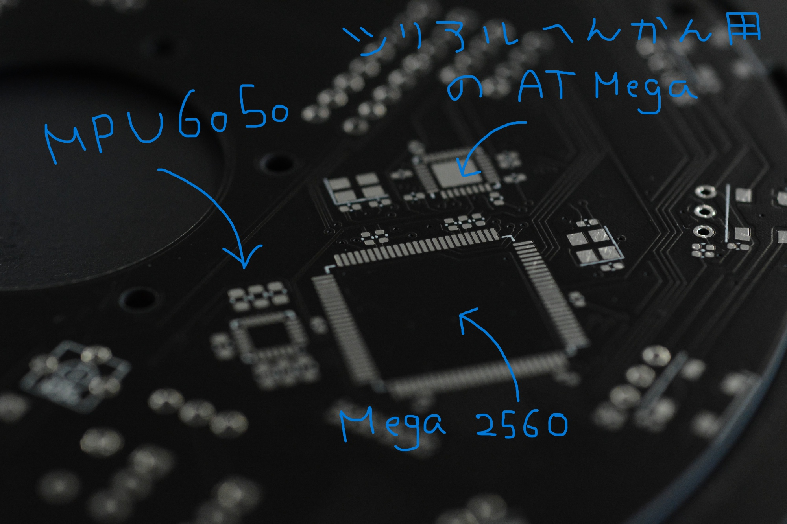
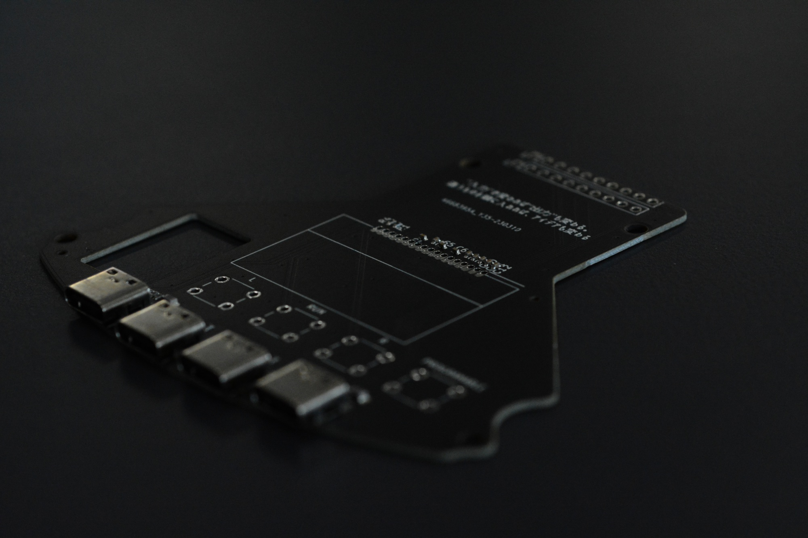
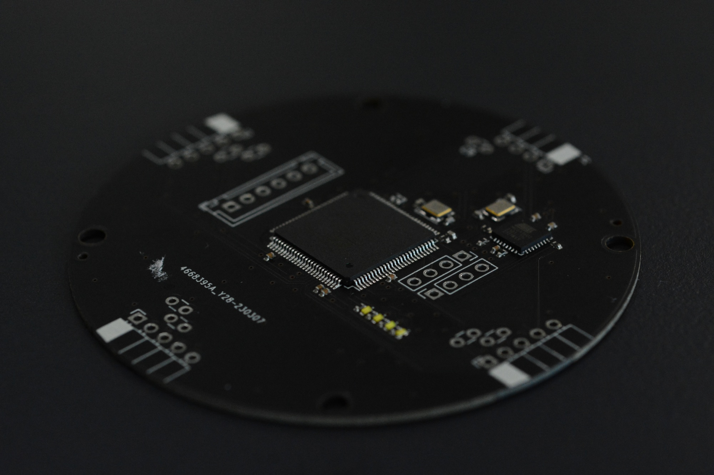
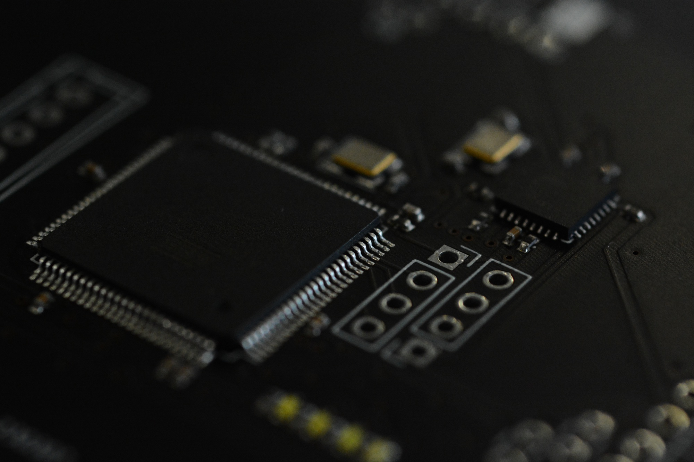
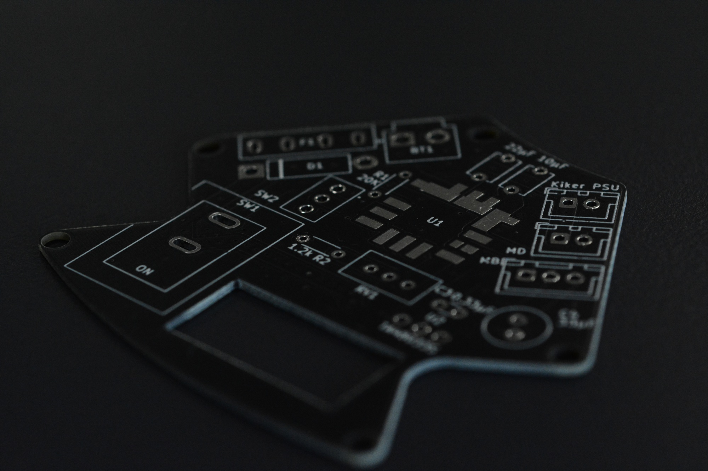

##### 公開:2023/07/15 更新:2023/07/15 writer:抹茶([@Matchya_RCJ](https://twitter.com/Matchya_RCJ))
---
 

# 第三回基板お披露目会！！

 
 
 

## 初めに
---
どうも抹茶です～～。 
前回の基板紹介記事で「次はハード解説をしようかと思います」みたいなことを言ってましたが、 
いろいろ忙しくてそんな時間もなく、
全国大会機の基板紹介を今回もやっていきたいと思います。 
（ 毎回毎回基板の紹介で申し訳ないです... 
実は前回の紹介記事と機体自体は変えてないので、追加で発注した分の基板の紹介になります～ 
今回もスポンサーのJLCPCB様に発注を無償で行っていただいています。また、今は新規ユーザーは＄54のクーポンがもらえるので是非JLCPCBを利用してみてください！！
詳しくは[こちら](https://jlcpcb.com/JPV)をのぞいてみてください！ 
JLCPCBでの基盤の発注の仕方は[こちら](https://munako-artemis.github.io/blog/20221230/index.html)で解説しているのでぜひ覗いてみてください！！
 
 

## メイン基板
---
 
 
基板の形自体は前回と変えてないですね。 
前回はArduino Leonaldoが2発乗っていたのが、Mega１発になってます。
主な処理はIRセンサ16個とジャイロの計算です。 
さらに軽量化のためにMPU6050も表面実装で自作したのですが、結局安定した動作が得られず、
モジュールを載せるはめになりました。。
ちなみに、Arduino Megaはピン数が多いのでいろんな処理を任せがちかもしれませんが、
ピン数のわりには性能が想像以上に低かったのでお勧めしません... 
今回もIRセンサとジャイロの処理を同時進行するだけでラグが発生したので(感覚的に１秒くらい？) 
何か１つに絞るか、これ以外のマイコンを使用することを勧めます。 
 
 
 
話がそれますが一眼のマクロレンズっていいですよね～こんな感じにズームインしてもきれいに映るので気に入ってます。 
マウスで文字書いてるので汚いですが許してください。。
 
 

## IO基板
---
 
 
前回のバージョンは配線ミスってたのと、メイン基板との接続に配線30本使うとかいうゴミ設計だったので、 
接続の配線を20本に減らしました。ロボット中にマイコンが転がってるので書き込み口を後ろに持ってきてます。 
ちなみにUSBが使えなかったのは内緒。 
USBは結構データ送信速度が早いので安易に基板の中だったり、
複数基板のなかを通すのはノイズが乗って通信できなくなるのでＮＧです。
あと、上のほうに一言入ってるのは気にしないでください、深夜テンションの結果です()
 
 

## ラインセンサの統合基板
---
 
 
これは4本に伸びてるラインセンサを1つの基板にまとめて、メインマイコンにデータを変換して送信するための基板です。 
これもArduino Megaを使用したためにメインマイコンとの処理にラグが発生し、"ラインを超えた後に信号が送られる" 
みたいなことが起こり、結局大会中に直すことができず、ライン出まくりでした。 
後日、シリアル通信ではなく、デジタル信号による簡易的な通信で制御してみたところ、ラグなく信号が送られ、 
問題なく制御できたので、やっぱりMegaは性能不足ってことですね。。（全国大会中に思いついていれば、、 
 
 
 
さっき紹介したメイン基板は部品が実装されているのが手元になかったので、ライン統合基板のMega周辺の写真だけでも 
貼っときます～ 
これもマクロレンズで撮ったものですね。
 
 

## 電源基板
---
 
 
最後に電源基盤ですね。なんだかんだ今まで問題なく動いてくれているのは電源基盤だけな気がします。 
電源まわりの設計は得意なのかもしれないですね。 
バッテリーからの電源を保護回路を通してMD、キッカーに送り、DCDCコンバータで5vに落とした電源をメイン基板に送るだけのものです。
DCDCは村田製作所さんの"OKL-T/6-W12N-C"を使ってます。
 
 

## 最後に
---
ここまで読んでくださってありがとうございます。毎回毎回、基板紹介の記事で申し訳ございません、、 
全国大会で使ったロボットの分解記事はロボットの運用が終わったら書こうと思ってるので楽しみにしててください～！！ 
（夏に宗像市主催の体験イベントに部活でブースを立ち上げるのと、部内大会を行うので、それまで待っててください！） 
ではここらで～ 