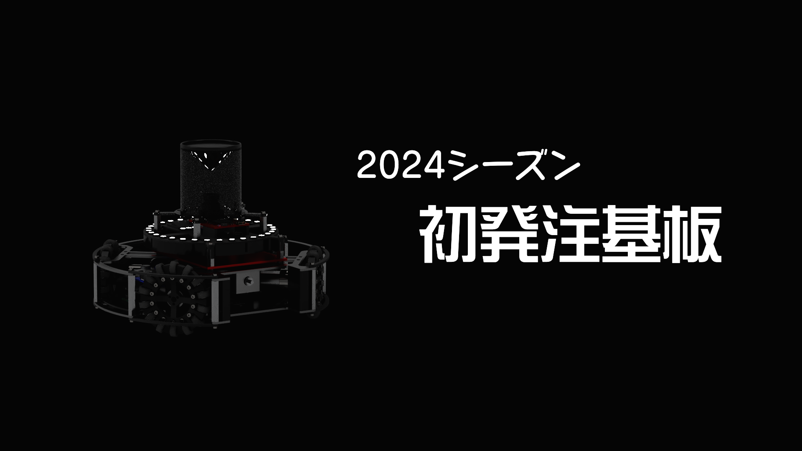

##### 公開:2023/10/12 更新:2023/10/12 writer:a_sa_hi([@asahi_robocuper](https://twitter.com/asahi_robocuper))
---
 

# 2024シーズン初基板着弾！！

 
 
 

## 初めに
---
どうも、a_sa_hiです。 
2024シーズンに入りましてようやくロボ河童らしい活動報告ができそうです。 
本当は僕ソフトウェア班のはずなのですがどういうわけかロボット設計に苦しめられることとなっています。 

<blockquote class="twitter-tweet" data-theme="dark">
なんかめちゃくちゃかっこいい機体できた <a href="https://t.co/ryydnf7Hnw">pic.twitter.com/ryydnf7Hnw</a>
&mdash; a_sa_hi (@asahi_robocuper) <a href="https://twitter.com/asahi_robocuper/status/1690291532472217600?ref_src=twsrc%5Etfw">August 12, 2023</a></blockquote> 
<blockquote class="twitter-tweet" data-theme="dark">
ロボカップあるある <a href="https://t.co/5CL35AoDYS">pic.twitter.com/5CL35AoDYS</a>
&mdash; a_sa_hi (@asahi_robocuper) <a href="https://twitter.com/asahi_robocuper/status/1711689706461933716?ref_src=twsrc%5Etfw">October 10, 2023</a></blockquote> 

今回発注した基板は上のツイートのロボット用の基板です。この記事を制作している時点で2機目の設計が90%終わっています。 
このロボットは本戦で使うことはありませんが、練習として作ってみた形になります。 
 

## 基板について
---
これから紹介する発注基板に関しては、中国のPCB製造メーカーであるJLCPCBさんに発注をして生産していただいた基板になっています。
以前の全国大会機の時にも発注をしており、低価格で高クオリティーな基板を製作していただけるのでとてもおすすめです。 
今なら<u>新規ユーザーに54$(記事制作時時価で約8000円)のクーポンを配布している</u>ようです。また、Twitterアカウントのフォロー+DMにより追加の10$クーポンを貰えるようです。 
基板を作ってみたいという方はぜひJLCPCBさんを利用してはいかがでしょうか。以下にホームページとTwitterアカウントを記載しておきます。 

#### JLCPCBのホームページ：[JLCPCB](https://jlcpcb.com/JPV)  
#### JLCPCBのTwitter(X)：[JLCPCB_Japan](https://twitter.com/JLCPCB_Japan)
 

## 基板紹介
それでは早速今回僕が発注した基板について紹介していきたいと思います。

### 電源基板

最初に紹介するのは電源基板です。 
ロボカッパーならお馴染み(?)村田製作所のDCDCコンバーターを用いた電源回路になっています。 
僕たちの使用用途でいえば、3セル(11.1v)のバッテリーの保護回路の搭載・DCDCを通したメイン基板(後述)の電源生成・モーター用の電源の生成の3つの機能を搭載しています。 
この基板結構ミスがありまして、まず電圧計をはめ込む穴が空いてませんでした。Edge-Cutsに線が引かれてるのかと思ったらSilkscreenに入ってて悲しくなりました。 
あともう一つ、バッテリーからの電圧が来てすぐのところのダイオードが逆向きになっていました。詳しくは下のツイート参照。(バッテリー刺した瞬間端子からスパーク発生して死ぬかと思った。) 
<blockquote class="twitter-tweet" data-theme="dark">
間違い探し 何が間違っているんでしょうか(白目 <a href="https://t.co/JhFV5HfcgQ">pic.twitter.com/JhFV5HfcgQ</a>
&mdash; a_sa_hi (@asahi_robocuper) <a href="https://twitter.com/asahi_robocuper/status/1709808914139943267?ref_src=twsrc%5Etfw">October 5, 2023</a></blockquote> 

### メイン基板

次に紹介するのはメイン基板です。 
メイン基板の役割としては、メインマイコン・ジャイロセンサ・カメラが主なものになります。
カメラのフットプリントが間違っていたこと以外はうまくいってて良かったです。 
お気に入りポイントはボタン3つとその下の自チームロゴ。マジでこれ作ってるときカッコよすぎてテンション上がってた。 
そうそう、この基板が一番分かりやすいんですが、コネクタ付近にそのピンの用途を書いておくことで回路図を見る手間を省くことができるのでとてもお勧めです。みんなもシルク拘ろうぜ！ 

### ラインセンサ基板

最後に紹介するのはラインセンサ基板です。 
昨年度の機体はラインセンサがあまり動いていなかったので、今回はちゃんと動かしてやろうと思い円形ラインとかいろいろしてました。結局一番完璧に動いた基板だったので良かったです。 
今は別の機体の設計中なのでもう弄りませんが、もしかしたらこのサイズじゃちょっと小さいかなとか思ってます。多分ラインアウトする未来しか見えない(n敗) 
 

## さいごに
以上で今回発注した基板の紹介は終わりです。 
2台目のロボット設計にしてはよくやったんじゃないかなと個人的には満足しています。ただいろいろ改善点も見られたので
そこは次の機体に活かして完璧に仕上げようと思ってます。次の機体が本戦出場予定の機体となるので気合い入れてがんばります！ 

(4日で気合いで作った新機体のロボット、下に置いておきます。)
<blockquote class="twitter-tweet" data-theme="dark">
ギリ四連休中に形になった！！！！！！！！  前回の機体からだいぶ成長できたのアツい！！！みんな見て！！！！！！   (ちなみに <a href="https://twitter.com/Matchya_RCJ?ref_src=twsrc%5Etfw">@Matchya_RCJ</a> のを結構参考にしてたりしてなかったり) <a href="https://t.co/Bfs2ObvDMK">pic.twitter.com/Bfs2ObvDMK</a>
&mdash; a_sa_hi (@asahi_robocuper) <a href="https://twitter.com/asahi_robocuper/status/1711258278968377754?ref_src=twsrc%5Etfw">October 9, 2023</a></blockquote>
 
 