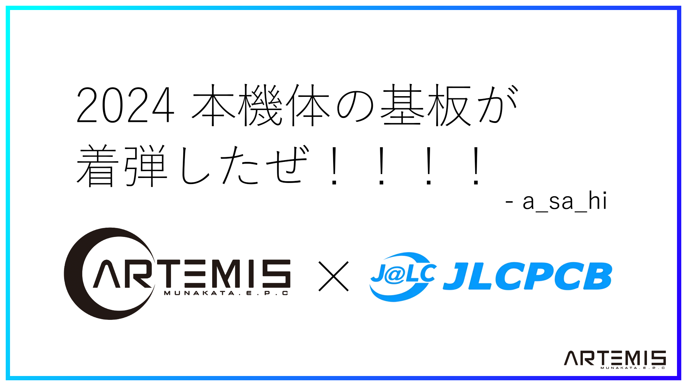

##### 公開:2023/12/22 更新:2023/12/22 writer:a_sa_hi([@asahi_robocuper](https://twitter.com/asahi_robocuper))
---
 

# 2024 本機体の基板が着弾したぜ！！！！

 
 
 

## 初めに
---
どうも、a_sa_hiです。 
ついに2代目の基板が着弾しました(といっても届いたのは大分前ですが)。 

<blockquote class="twitter-tweet" data-theme="dark">
ギリ四連休中に形になった！！！！！！！！  前回の機体からだいぶ成長できたのアツい！！！みんな見て！！！！！！   (ちなみに <a href="https://twitter.com/Matchya_RCJ?ref_src=twsrc%5Etfw">@Matchya_RCJ</a> のを結構参考にしてたりしてなかったり) <a href="https://t.co/Bfs2ObvDMK">pic.twitter.com/Bfs2ObvDMK</a>
&mdash; a_sa_hi (@asahi_robocuper) <a href="https://twitter.com/asahi_robocuper/status/1711258278968377754?ref_src=twsrc%5Etfw">October 9, 2023</a></blockquote> 

組みあがったロボットの解説はまた今度するとして、今回は発注した基板について色々説明したいと思います。 

## 基板について
---
これから紹介する発注基板に関しては、中国のPCB製造メーカーであるJLCPCBさんに発注をして生産していただいた基板になっています。 
以前の全国大会機の時にも発注をしており、低価格で高クオリティーな基板を製作していただけるのでとてもおすすめです。 
今なら<u>新規ユーザーに54$(記事制作時時価で約8000円)のクーポンを配布している</u>ようです。また、Twitterアカウントのフォロー+DMにより追加の10$クーポンを貰えるようです。 
基板を作ってみたいという方はぜひJLCPCBさんを利用してはいかがでしょうか。

また、JLCPCBさんは3Dプリントサービスも行っています。以前一度発注をしたことがあるのですが、とても品質が良かったです。 
機会のある人はぜひ試してみてはどうでしょうか。 

以下にホームページとTwitterアカウントを記載しておきます。 

#### JLCPCBのホームページ：[JLCPCB](https://jlcpcb.com/JPV)  
#### JLCPCBのTwitter(X)：[JLCPCB_Japan](https://twitter.com/JLCPCB_Japan)

 

## 基板紹介
それでは早速今回僕が発注した基板について紹介していきたいと思います。

### 電源基板

まずは電源基板から。と言っても前回とほとんど構成は一緒です。違いがあるとすれば、電源出力部分の削減・ダイオードの向きの修正・電圧計の穴修正等です。 

詳しくは [この記事](https://munako-artemis.github.io/blog/20231012/index.html)
で解説してるので興味がある人はぜひ。 

### メイン基板

次にメイン基板です。この基板作ってるとき朝5時とかだったのでマジで脳みそ働いていなかった。 
そのせいで重大なミスをやらかしてしまいました。
<blockquote class="twitter-tweet" data-theme="dark">
てめぇマジで殺すぞ！！！！！！！！！！！！！！！！！ <a href="https://t.co/lYisiTfySE">pic.twitter.com/lYisiTfySE</a>
&mdash; a_sa_hi (@asahi_robocuper) <a href="https://twitter.com/asahi_robocuper/status/1717454328884236575?ref_src=twsrc%5Etfw">October 26, 2023</a></blockquote> 
マージで何やってんですかねぇ…(困惑) 

まあ小話はさておいて、この基板にはメインマイコン、ジャイロセンサ処理用マイコン、センサー基板(後述)との接続とかの機構が乗ってます。 
マジで場所少なすぎて困った。でも出来はめちゃくちゃいいので全体的に満足。ただし配線ミス、お前だけは許さん。 
 
ちなみに裏にはロゴたちが乗っています。カッコいいね！ 

 

### センサー基板
 
これがセンサー基板になります。この基板には、ボールセンサ(処理マイコン含む)、カメラ、UI周辺を備えています。 
　いずれ<strike>Twitter</strike>Xのほうに動画を乗せると思いますが、今はSSD1306(秋月電子通商で購入)をI2Cで接続してロボットのモード切替やセンサー状況、ロボットの設定等が可能になっています。マジでUI乗せるだけでRCJのQOL爆上がりになるので皆さん載せましょう。 
　カメラには引き続きOpenMV H7を使用しています。やっぱり手っ取り早く使えて楽だからとても便利なんですよねぇ…。カメラには主にゴールの認識をしてもらっています。 
　また、ボールセンサの処理にはSeeeduino Xiao(無印)を使用しています。
方法は単純で、各ピンに8個のセンサを割り当てて、ベクトル演算で角度・距離を算出しています。 
そういえば、2日前くらいにブートローダーがぶっ壊れたSeeeeduino Xiaoを大量生産してしまったのですが、正常なXiaoを用いてブートローダーの書き込み・保護を行う方法を見つけたのでいずれ紹介するかもです。  

### エンジェルライン基板
 
最後に紹介するのはエンジェルライン基板です。前回から直径を約4cm位大きくしたような気がします。 
この基板は光変調フォトIC(S4282-51)というセンサーを用いて反射光を検出し、反応した場所によって移動すべき方向を算出・シリアル通信で送信という形になっています。 
まあ例によってこの基板が一番安定して動いた…っていうわけじゃなかったです。実はセンサーとセンサーの間が2cm以上空いているという致命的欠陥を抱えています。これによってライン上で反応していないと認識する<strike>カス</strike>基板になってしまいました。全国大会までには修正します。  

## 現状報告
北九州ノード大会に出場しました。結果は19チーム中1位？だか2位？だったかだと思います。(曖昧なのは5チームずつに分割して試合を行ったため) 
その時の好プレイ集を<strike>Twitter</strike>Xにまとめてるのでぜひご覧ください。下に貼り付けときます。
 
<blockquote class="twitter-tweet" data-lang="ja" data-theme="dark">
ノード大会好プレー集です！ <a href="https://t.co/6mcTRrHoYU">pic.twitter.com/6mcTRrHoYU</a>
&mdash; a_sa_hi (@asahi_robocuper) <a href="https://twitter.com/asahi_robocuper/status/1731697225498022300?ref_src=twsrc%5Etfw">2023年12月4日</a></blockquote> 
 

## さいごに
JLCPCB最高！みんなも発注してロボットのQualityを爆上げしよう！ 
 
あと1月7日に九州ブロック大会に出場します。ドリブラーとキッカーを搭載したロマン機で暴走しようと思ってるので期待しててください(?) 
<blockquote class="twitter-tweet" data-theme="dark">
この姿を見せるのは初めてかな 近いうちに動作してる様子が見られる…はず(予定は未定 <a href="https://t.co/FQdY2W9pKd">pic.twitter.com/FQdY2W9pKd</a>
&mdash; a_sa_hi (@asahi_robocuper) <a href="https://twitter.com/asahi_robocuper/status/1737842911407169832?ref_src=twsrc%5Etfw">December 21, 2023</a></blockquote> 