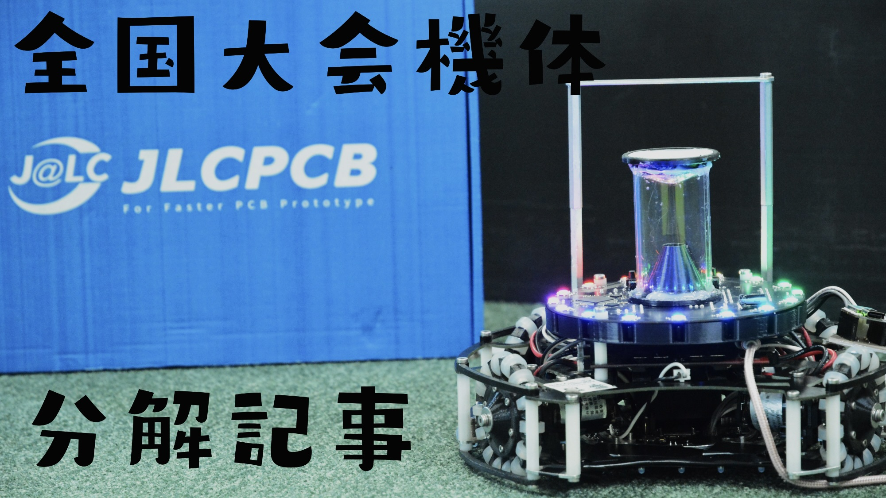
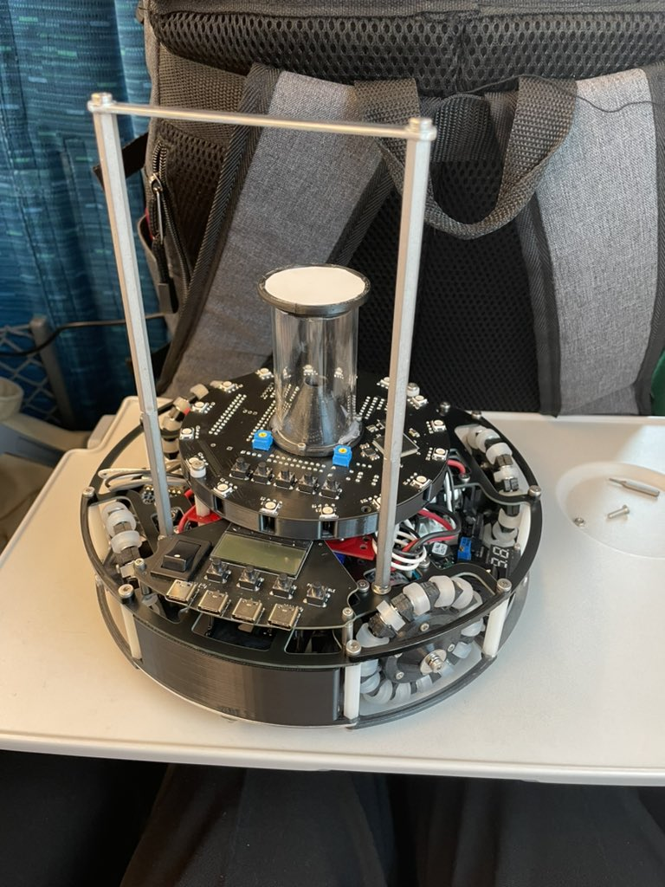
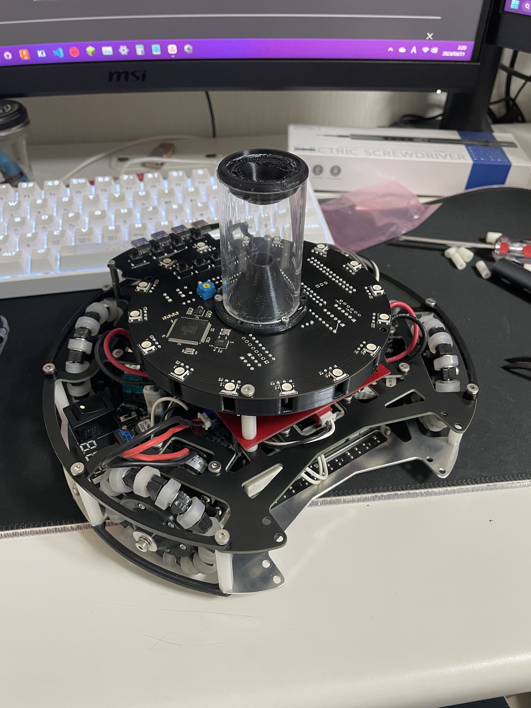

##### 公開:2024/01/25 更新:2024/01/25 writer:抹茶([@Matchya_RCJ](https://twitter.com/Matchya_RCJ))
---
 

# 2023年全国大会機体分解記事！！

 
 
 

## 記事書くの遅すぎないか？？
---
どうも久しぶりの抹茶です～～。 
はい。記事上げるのめっちゃ遅くなりました。写真自体は準備してたんですけどね... 
ところで2024全国大会まで約2ヶ月になりましたがなんで去年の全国大会の機体の記事を書いてるんでしょうね。。 
（はよロボット作れ） 
まぁ、色々忙しかったといえば嘘なんですが、やっと分解記事書いたのでよかったら読んでいってください！ 
始めて自分のロボットの分会記事を書くのでおそらくめっちゃ下手だと思いますがあたたかい目で見てください...
 
 

## 概要
---
 
 
 
この機体は2023全国大会用に制作した機体で、自分が制作した５台目の機体です。(数え間違えてなければ５台目) 
設計中に特に重視したのは 

　・宗像高校電気物理部らしくない機体 
　・デバッグ性、操作性の良さ 
　・かっこよさ 

です。(誰も有言実行できたとは言ってない) 

デバック性、操作性、かっこよさは言うまでもないですが、どうやら審判の方々、電気物理部OBの先輩方はうちの部活のロボットといえば、
アルミ複合板フレーム、TJ3Bコア、ダイセンモータ、超音波せんさでのライン処理　　が定番らしく。。 
今年こそはSNSで見かけるようなかっこいい機体作るぞ〜ってことで発注基盤やジョンミンモータ、カメラ等々の使ったことないものを色々ぶっ込んだわけですね。 
 
 

## 完成像、仕様
---
 
 
 
先ほども言ったようにこれは５台目の機体で、CADを使いこなせるようになってきたりして、やっとデザイン性までこだわりながら設計できるようになってきた感じですね。
ほとんどパクリなのでは？と言われるとそこまでなんですが、デザインの方は主にしろくまさんの2022シーズンの機体を参考に設計してます。 
部品の構成はこんな感じになってます。全国大会のプレゼンシートから引用してきてます。
 
 
 

## 上段
---
 
 
 
上段にはモータドライバ、メイン基板、IO基板の３つが固定されています。 
まず、メイン基板の4本のネジを外すと、メイン基板とIO基板がセットになってはずれ、さらにスペーサーを外すと、ダイセンのモータドライバが外れるようになってます。 
メイン基板とIO基板はピンヘッダとピンソケット10＊２で接続されており、配線を使わずに接続できるようになっています。 
　　※欠陥：ロボットを動作させている際、振動でソケットとピンが外れていき、最終的に外れることがあります、 
 
 

## 下段
---
 
 
 
上のフレームを外すと、中に電源基板、キッカーの昇圧基板、キッカーの制御基板、モータが収納されています。 
上のフレームにはソレノイド、バッテリーケースが固定されています。
中の部品を交換する前提で設計してなかったため、上のフレームを外さないと中の基板の取り外しができないようになってるのはちょっと失敗かなぁとは思ってますが、
配線は組み上がった状態でもある程度いじれたのでそこまで困ることはなかったですね。 
 
 

## 足回り
---
 
 
 
モータはジョンミンモータこと、JoinMax社のJMP-BE-3561を使用してます。 
(もうすでに生産終了しており入手できないようになっています。) 
ルール変更でライン外の大きさが小さくなったり、全体的に3Dプリンタでロボットの筐体を作るチームが増えている中、強度ゴリゴリのトルク化け物のモータはちょっとミスった気はします。
速度はだいぶ落としてたので他チームのロボットを破壊するなんてことは起こりませんでしたが、モータの値を0〜20％でいじらないといけなかったのでなかなか制御は難しかったです。 
固定方法については仕様上、上と下のフレームで計4本のネジで固定しないといけないため、取り外しが少しめんどくさいですが、これはどうしようもなかったですね。
 
 
 
オムニホイルはYumeに作ってもらったものをはかせてます。
直径が60mmで、並行ピンとシリコンチューブで作ったサイドホイールを12個円形上に並べています。 
ただでさえ、モータの回転数とトルクがバケモノのモータを使ってるのに、ホイールを大きくしてしまったのも失敗でした。。
せめて直径は50mmあたりにしておくべきだったかなぁとは思います。
 
 

## 裏面
---
裏面にはラインセンサ4本と、その4本を1箇所にまとめる中央基板が載ってます。 
こっちは、他のところを分解せずに取り外しができるように外側からネジで止められるようになっていて、下のフレームにタップを開けてネジを止められるようにしています。
 
 
 
ラインセンサは前のセンサ以外は、内側と外側で信号を分けていて、今どのくらいラインを踏んでいるのかがわかるようにしています。 
まぁ、結果としては反応したか、反応してないかだけ見て、カメラの情報を頼りにライン制御してたので無駄な努力だったかとは思います。
 
 
 
中央の統括基板は、4本のラインセンサをピンソケットとピンヘッダで接続していて、Mega2560でラインの制御を行っています。
こいつも謎の通信のラグが起こって、最終手段としてラインセンサが反応したらデジタルの信号をHIGHにしてメインマイコンに信号を送ってました。 

## 口周り
---
最後にロボットの口周りについて解説しようと思います。 
まぁ、特に変わった特徴があるわけでもないので解説のしようもないですが、形はこんな感じになっています。 
裏からの写真で申し訳ないです。。（いい感じに伝わる写真がなかった）
 
 
 
タッチセンサとして、ラインセンサと同じ光変調フォトICとLEDを組み合わせてボールの補足を検知しています。 
ボールがセンサとLEDの間に入ったらデジタル信号が下がるってだけの簡単なものですね。
 
 
 

## 終わりに
---
こんな感じで2023全国大会に出した機体のハード解説を簡単に行ないましたが、なかなか下手ですね。。ここまで読んでくださってありがとうございます...
実物じゃなくて写真でその機体の特徴とかこだわりを説明することが結構難しいってことに気付かされましたね、、
今回はロボットの構成、部品配置など、簡単に説明しただけですが、他の基板の解説記事でそれぞれの基板の役割などを解説しているので、詳細が気になる方はそちらの方もご覧ください。 
次の機体はこの機体の反省を生かして、もっとすごいのを作ろうと思ってるので、ぜひ楽しみにしといてください！！ 
ってことでロボット作りに戻ります。ではここらで〜〜