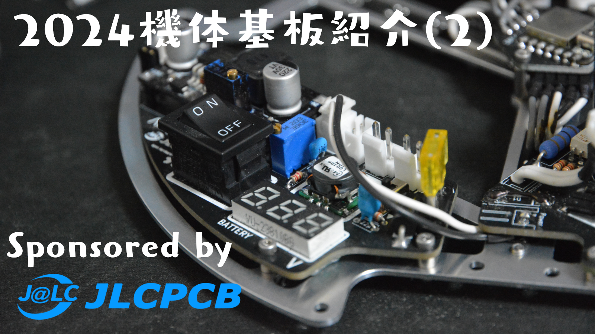

##### 公開:2024/01/25 更新:2024/01/25 writer:抹茶([@Matchya_RCJ](https://twitter.com/Matchya_RCJ))
---
 

# 2024シーズン機体基板紹介

 
 
 

## 初めに
---
どうも抹茶です～～。 
今回紹介する基板は前回紹介した基板の修正版が主になります。 
毎回毎回同じような紹介ですが、早速基板の紹介に入っていきたいと思います。
 
 

## スポンサー様
---
この記事で紹介する基板はいつもと同じく、JLCPCB様にスポンサーとして無料同然で製造していただいています。 
また、今は新規ユーザーは＄60のクーポンがもらえるので是非JLCPCBを利用してみてください！！ 
詳しくは[こちら](https://jlcpcb.com/JPV?from=VGPJP&gad_source=1&gclid=Cj0KCQiAh8OtBhCQARIsAIkWb6-Nsn19GPWQXA-fvZVW8wMP9Eka_3Mpn_2V5Xhsw0oPhY9CmHIowX4aAkU3EALw_wcB)をのぞいてみてください！また、JLCPCBの日本語のサイトは[こちら](https://jlcpcb.jp/)です。 
基板の発注方法については[こちら](https://munako-artemis.github.io/blog/20221230/index.html)で解説しているのでぜひ覗いてみてください！！
 
 

## メイン基板
---
 
 
前回紹介したメイン基板と搭載しているコンポーネント自体は変わっていないですが、
致命的ではなかったものの、少々配線ミスをしてたのでそれの修正を行いました。(5vラインと12vラインがひっくり返っていたのは内緒) 
搭載部品等については前回の記事で紹介しているので気になればぜひ見てみてください〜
 
 

## ラインセンサ
---
 
 
次にラインセンサですね。。ラインセンサは昔から相性が悪くて自分が設計したものが1回で動いたことはない気がします。。 
前回はセンサ5個を１ポートづつデータとってましたが、今回は数を4個に減らして２ポートでデータをとってます。 
ちゃんと動作はしましたが、やっぱり円形ラインか、せめて十時型のラインセンサにするべきですね。
 
 

## ライン処理用基板
---
 
 
そしてさっきのラインセンサに引き続き、ライン処理用の基板です。 
マルチプレクサを外して直接Seeeduinoにセンサを接続しています。 
 
 

## ジャイロバックアップ用基板
---
 
 
これは何かの基板の修正ではなく今回初めて発注した基板です。
現在、ジャイロセンサとしてM5StackのStickCを搭載しているのですが、
万が一うまく動作しなくなったらセンサ自体を交換できるようにStickCの形に合わせてバックアップ用にこれを作りました。
去年はMPU6050が大会中に正常動作しなくなり、(新品に交換しても)ほかにジャイロセンサを準備していなかったために惨敗しました。
今年はそんなことがないようにStickCとは別にSeeeduinoとL3GS20Hを組み合わせたバックアップ基板を作ってます〜
 
 

## Teensy Breakout Board
---
 
 
これはTeensy4.0の裏の表面実装パッドのピンまで使えるようにする拡張基板です。
手元に予備として在庫がなくなったので追加で発注させていただきました。
Teensyのシリアルとか特にずべてのポートを使えるようになるのでめっちゃ愛用してる拡張基板です。
 
 

## フレーム等
---
 
 
最後にフレーム用に発注した基板ですね。
明らかに発注目的が変わってきますが、パターンのない基板として発注することで基板と同じ素材のフレームとかが作れます。
個人的には設計次第では金属並みの強度に「曲がらない」という特性が手に入る上、色まで選べるので去年の機体から愛用しています。
今回は上のフレームとバッテリーケースとなる小さい板を発注しました。
 
 

## 最後に
---
ここまで読んでくださってありがとうございます。そろそろ基板紹介以外にも技術系の記事を書きたい。。。 
ではここらで～ 