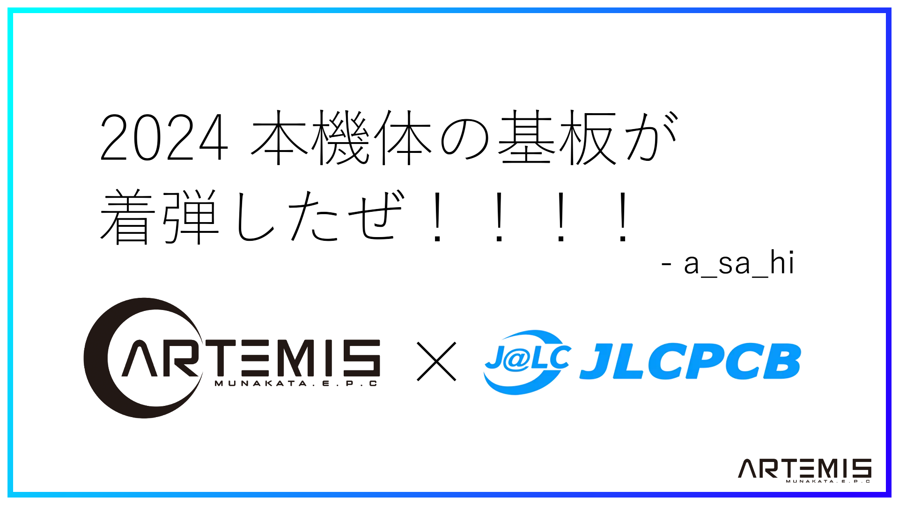

##### 公開:2024/XX/XX 更新:2024/XX/XX writer:a_sa_hi([@asahi_robocuper](https://twitter.com/asahi_robocuper))
---
 

# ジャパンオープン2024を終えて

 
 
 

## 初めに
---
皆さんどうも、Munako Artemis所属のa_sa_hiです。 
~~ジャパンオープンが終わってから早一週間が経とうとしてる頃、皆さまいかがお過ごしでしょうか。
僕は体力なさ過ぎて疲れたので寝ては遊んで寝てみたいな生活を繰り返しています。~~ 
 
時間は何とも残酷なもので、文化祭の準備やらなんやらをしていたらいつの間にか6月3日になっていました。 
こういうのは早くしないといけないものなんですがね。申し訳ない。 

 
それはさておき、この記事では3/22~3/24に開催された「RobocupJunior JapanOpen2024 Nagoya」についての振り返りをまとめていきたいと思います。反省点とか色々あったのでそれをこれからのチーム活動に活かしていこうとかそういうノリです。 
 

## 結果報告
---
まずは結果報告から。 
僕たちのチームは帰りの新幹線が迫っていたので閉会式どころか最終試合後の試合チェックをする暇もなく退出したので
直接結果を見たわけではないのですが、どうやら世界大会推薦順位3位だったようです。 
まあ、これに至るまでに色々なアクシデントがあったのですが、これはまた後で触れます。 
 

## 1日目 - セットアップ日
---
僕たちのチームはセットアップ日の前日から名古屋入りしていたので、セットアップ日までは比較的ゆっくりできた印象があります。 
セットアップ日ではロボットの車検と調整を行いました。なんと、今回の大会では車検で引っかかった点が1つもなく、全て完璧に車検を通すことができました。 
全国大会の車検は比較的厳しいような印象を受けていたので、これは案外凄いことじゃないかなと自負しています。なんだかんだ車検に一発合格できるロボットを作るのが一番難しいと思う(経験談)。 
 
車検を通した後、3時から6時30分までロボットの調整をしていました。そこで、今大会上位層に君臨(?)していたOi_DENGIKEN、Edge、そいそーすの方々(敬称略)と出会いました。 
やっぱ~~Twitter~~Xで見てたロボット達を生で、しかも間近で触りながら見れるっていうのはとても幸せでした。特にたぬきさんのロボットが軽すぎてビビった。あれどういう設計したらあんな軽くなるんだ？
 
 

## 2日目 スイス式 1~5戦
---
この日から試合が始まりました。今大会のルールとしては、7試合分のスイス式トーナメント(詳しくは調べてください)を行い、その結果の上位4チームが世界大会への推薦順位決定をするリーグ戦に参加できるというものでした。 
そのため、世界大会に行くという目標を持つ私たちにとっては、2試合落としたらほぼ終わりのようなもので、朝からものすごい緊張感がありました。

 

### 1試合目 vs F・N・R(東海ブロック)
4-1で勝利しました。 
 
スイス式トーナメント1試合目はF・N・Rさんとの試合でした。周りからの視線がすごく心臓バクバク。
前日の調整もうまくいっていたので大丈夫だろう...と思っていました...が、ジャイロセンサーの不具合が多発。 
なんとかドリブラーとキッカーとカメラという~~技術の暴力~~で勝つことができましたが、何とも怪しい試合でした。 
対して相手チームは安定して動いていて、普通に負けていてもおかしくない試合でした。 

 

### 2試合目 vs チームブルー(四国ブロック)
4-1で勝利しました。 
 
実は四国ブロックのライブ配信を見ていたのでどんなロボットなのかは(一方的に)知っていました。 
1試合目でも痛感しましたが、ちゃんと姿勢制御して動いているロボットは安定して強いです。マジで反省。 
2試合目から、バックアップ用のジャイロセンサーに付け替えたため、比較的こちらも安定して動くようになった(はず)です。
詳しくは[1つ前の記事](https://munako-artemis.github.io/blog/20240314/index.html)をご覧ください。ハードウェア班が優秀でした。 

 

### 3試合目 vs 「Queue」三田学園物理部チーム(阪神ブロック)
8-0で勝利しました。 
 
個人的には相手チームの灰色ロボットがとても面白かったです。最低限の穴だけ開いていて、それ以外が全て隠されているという、見かけない構造をしていました。
動画撮影してるときも「凄いね、相手のロボット」と言葉をこぼしてました。 
見た目だけじゃなく、ボールもきれいに追っていたので、とても見ごたえのある試合でした。 
 
自チームでは、前日の交流の時に戦った時、3輪機がトルク負けしていたことに気づいていたため、キーパーであった4輪機を急遽アタッカーに、ダブルアタッカー構成にしました。 
この試合からずっとこの体系でロボットを動かしていましたが、やっていてよかったなと思います。やはり臨機応変に動くのが大切だなということを感じさせられました。
しかし、問題が起きた(?)のは次の試合です...。 

 

### 4試合目 vs そいそーす(阪神ブロック)
1-8で敗北しました。 
 
なんと、前日から「当たりたくないなぁ」なんて思っていたそいそーすと当たってしまいました。試合表が出た時はチーム一同絶望していました。 
なぜかというと、そいそーすのロボット(特にアタッカー)は、白線から出ない・ゴール方向への姿勢制御が完璧・回り込み早いの三段構えで、太刀打ちできると思えていなかったからです。まあ考えていた通り勝てなかったですが。 
この試合から、「ロボットにラインセンサーを追加で付けるべきじゃないか」という案が浮かびました。これについては後述します。 

 

### 5試合目 vs Team Takahama MKM(東海ブロック)
9-4で勝利しました。 
 
確かこの試合まで、相手チームが全勝していたはずなので、さっきの試合みたいに負けるんじゃないかと不安でした。 
前半はどちらのチームも同じくらい点数を取っていて、正直勝てそうかなという希望はあまり見えませんでした。しかし、戦況が変化したのは後半です。 
 
こっからドリブラー・キッカーを搭載したロボットが**動き出します**。X(Twitter)に投稿したクリップもその1部です。 
やはり自分がプログラムした動作が試合で実際に動くと嬉しいものがありますね。よかった。 

 
 
そんなこんなで1日目の試合が終了しました。
現状、4勝1敗で、残り2試合。ここでもう1負したらリーグ戦に上がるのは厳しい状況です。 
 

## 2日目 ホテル内
---
ここで、4試合目の時に気づいた「ロボットにラインセンサーを追加で付けるべきじゃないか」という案を実行しました。 
3輪機の方はチームメンバーが途中で寝落ちしたので付けれませんでしたが、4輪機の方は頑張ってつけてくれました。これがめちゃくちゃ功を奏しました。ありがとう。 
具体的には、円形ラインセンサーのサイド(左右)に2つずつセンサーを突貫工事で付けました。大会中はんだごては持たないつもりだったんだけどなぁ...。 
 
 

## 3日目 スイス式トーナメント 6・7戦
---
ここから大波乱の幕開けです。1つ1つの試合が濃すぎた。 
 

### 6試合目 vs ryof(関東ブロック)
5-0で勝利しました。 
 
ドリブラーvsドリブラー、今世紀最大の大合戦でした。ダブルアタッカーにしていたので何とか勝利することができました。 
この試合で初めてロボットの電源が落ちました。というよりマイコンにリセットがかかったのかな？未だに原因はわかっていません。多分プログラムの問題。 
さて、5勝1敗で、成績としては上位にいる状態で、当たっていないチーム...と考えると、嫌な予感がしました。そしてその予感は的中します。 
 

### 7試合目 vs Edge(京滋奈ブロック)
0-8で敗北しました 
 
マジで当たりたくなかった。前日調整の時から「優勝だろ」とか言われてたチームと当たってしまいました。絶望も絶望です。 
一応試合上は善戦してたつもりなのですが、得点を見たらひどいことになっていました。 
 
この試合に関しては真面目に分析したいと思います。というか、どの試合にも言えることなのですが、やはりラインアウトをしないロボットは本当に強いです。 
ラインアウトをしない = 試合にずっと関われるということなので、次作ロボットはラインセンサーを本気で作るべきだなと感じました。 
あと、ラインセンサに関わる話でもありますが、全体的にロボットの速度が速かったです。秋月モーター(自チーム使用)もある程度の速度は出せるはずなのですが、
ラインセンサの都合上最大スピードが出せない状況でした。こういう面でもラインセンサの重要性を強く感じました。 
 
プッシングに関しても、ゴールキーパーがいる状態でのゴール付近でのシュートはプッシングを取られかねないため、キッカーを有効活用して遠くからシュートする重要性を
強く感じました。 

 

はい、スイス式トーナメント7試合が終わりまして、結果としては5勝2敗という結果となりました。 
正直いけるという希望はありませんでしたが、事前に呼ばれたチームが3チームということもあり、「ワンチャンあるか？」とか思っていました。 

