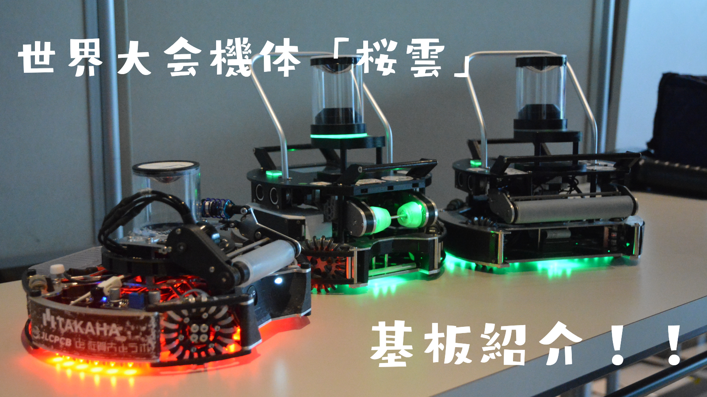

##### 公開:2024/09/10 更新:2024/09/10 writer:抹茶([@Artemis_Matcha](https://x.com/Artemis_Matcha))
---
 

# 桜雲基板紹介！！

 
 
 

## 初めに
---
どうも抹茶です～～。 
先日世界大会に出場し、そのために新機体「桜雲」を制作したので今回はJLCPCB様に発注させていただいた基板の紹介を行っていきたいと思います！！
（少々投稿が遅くなってしまったのは大変申し訳ないです...）
 
 

## スポンサー様
---
この記事で紹介する基板はいつもと同じく、JLCPCB様にスポンサーとして無料同然で製造していただいています。 
JLCPCBの日本語のサイトは[こちら](https://jlcpcb.jp/)です。 
基板の発注方法については[こちら](https://munako-artemis.github.io/blog/20221230/index.html)で解説しているのでぜひ覗いてみてください！！
 
 

## メイン基板
---
 
 
メインマイコン、ロボット間通信用モジュール、大会公式通信モジュール、IMUセンサが搭載されています。 
　・メインマイコン：Teensy4.0 
　・通信モジュール：Twelite UART 
　・ジャイロセンサ：BNO055
 
 

## 円形ラインセンサ
---
 
 
Seeeduino Xiaoとマルチプレクサを組み合わせて、センサ32個を16ポートで読み取っています。 
LEDは624nmの赤色LEDを使用しています。 
光量大きすぎて電流大きくなって発熱するのが失敗でしたね...もう少し光量落としてよかったかも（）
 
 

## サイドラインセンサ
---
 
 
さっきの円形ラインセンサに引き続き、サイドラインです。センサ7個を並列１ポートで読んでます。
 
 

## センサ基板
---
 
 
主にIRセンサとカメラが搭載されている基板です。他にもディスプレイや操作用のボタン類が搭載されています。 
　・センサ：TSSP58038 
　・カメラ：OPEN MV H7
 
 

## MD・キッカー基板
---
 
 
今回のロボットの中で一番気に入ってる基板です。モータドライバとキッカーの回路が全て内蔵されています。 
モータドライバICはVNH5019で、41v30Aの連続供給に耐えられます。難点としてはPWM周波数を20kHzまでしか受け付けないところですね...
コアレスモータだと少々効率が落ちたり、発熱します。
 
 

## 電源基板
---
 
 
最後に電源基板です。過去1小さく収めることができました。 
いつもと同じようにMurataのDCDCコンバータを使って制御用電源を生成しています。
 
 

## 最後に
---
ここまで読んでくださりありがとうございました。 
今回はいつもより基板概要についての説明が短くなってしまいましたが、近日中にロボットの分解記事？ハードウエア解説？を投稿する予定なのでお楽しみに！！
ではここらで～ 